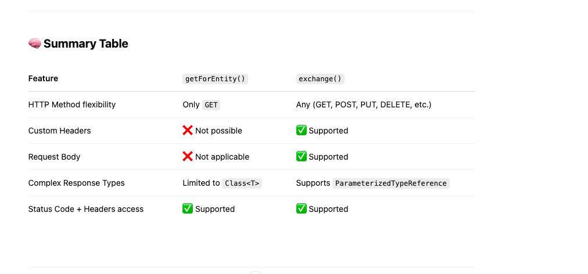
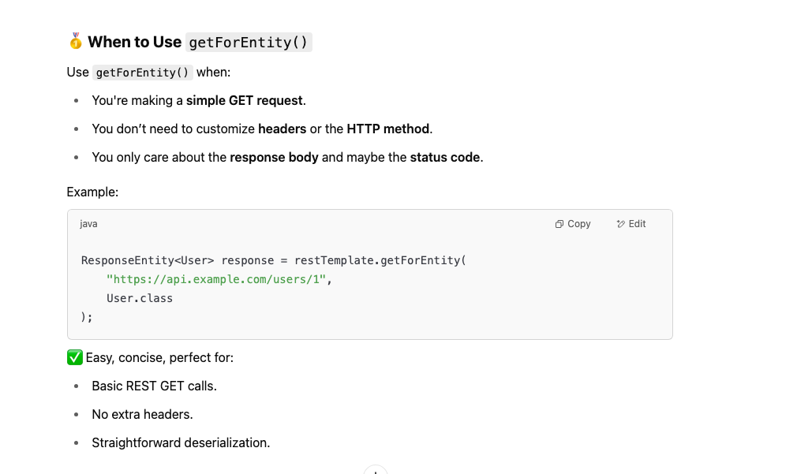
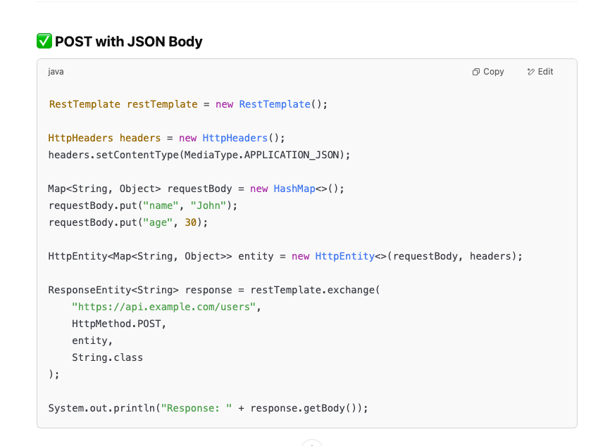
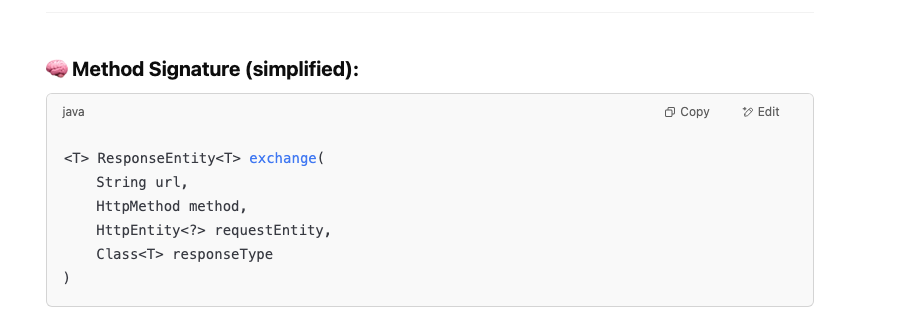
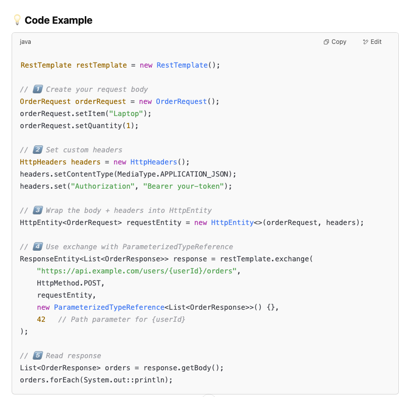

#Debugging Guide - Microservices - V2







- 
- 
- [Spring Boot & Spring Cloud Versions](#spring-boot--spring-cloud-versions)
- [URLs](#urls)
- [Debugging Guides](#debugging-guides)
	- [Spring Cloud Config Server - Steps 01 to 08](#step-01)
		- [Step 01](#step-01)
		- [Step 02](#step-02)
		- [Step 03](#step-03)
		- [Step 04](#step-04)
		- [Step 05](#step-05)
		- [Step 06](#step-06)
		- [Step 07](#step-07)
		- [Step 08](#step-08)
	- [Setting up Currency Conversion and Currency Exchange Microservices](#Setting up Currency Conversion and Currency Exchange Microservices)
		- [Step 10](#step-10)
		- [Step 11](#step-11)
		- [Step 12](#step-12)
		- [Step 13](#step-13)
		- [Step 14](#step-14)
		- [Step 15](#step-15)
		- [Step 16](#step-16)
		- [Step 17](#step-17)
	- [Debugging problems with Feign](#debugging-problems-with-feign)
		- [Step 18](#step-18)
	- [Eureka - Step 19 to 21](#eureka---step-19-to-21)
		- [Step 19](#step-19)
		- [Step 20](#step-20)
		- [Step 22](#step-22)
	- [Spring Cloud API Gateway](#spring-cloud-api-gateway---step-22-to-step-25)
		- [Step 22](#step-22-1)
		- [Step 23](#step-23)
		- [Step 24](#step-24)
		- [Step 25](#step-25)
	- [Circuit Breaker](#circuit-breaker---26-to-29)
		- [Step 26 to 29](#step-26-to-29)
	- [Docker Section - Connect Microservices with Zipkin](#docker-section---connect-microservices-with-zipkin)
		- [Docker Step 12](#docker-step-12)

##Spring Boot & Spring Cloud Versions

```xml
	<parent>
		<groupId>org.springframework.boot</groupId>
		<artifactId>spring-boot-starter-parent</artifactId>
		<version>2.7.3</version>
		<relativePath/> <!-- lookup parent from repository -->
	</parent>

	<properties>
	    <java.version>21</java.version>
	    <spring-cloud.version>2021.0.3</spring-cloud.version>
  	</properties>
```


##URLs

###Limits Service
- http://localhost:8080/limits

###Cloud Config Server
- http://localhost:8888/limits-service/default
- http://localhost:8888/limits-service/qa
- http://localhost:8888/limits-service/dev

###Currency Exchange Service
- http://localhost:8000/currency-exchange/from/USD/to/INR

###Currency Conversion Service
- http://localhost:8100/currency-conversion/from/USD/to/INR/quantity/10
- http://localhost:8100/currency-conversion-feign/from/USD/to/INR/quantity/10

###Eureka
- http://localhost:8761/

###Spring Cloud Api Gateway

Initial
- http://localhost:8765/CURRENCY-EXCHANGE/currency-exchange/from/USD/to/INR
- http://localhost:8765/CURRENCY-CONVERSION/currency-conversion/from/USD/to/INR/quantity/10
- http://localhost:8765/CURRENCY-CONVERSION/currency-conversion-feign/from/USD/to/INR/quantity/10

Intermediate
- http://localhost:8765/currency-exchange/currency-exchange/from/USD/to/INR
- http://localhost:8765/currency-conversion/currency-conversion/from/USD/to/INR/quantity/10
- http://localhost:8765/currency-conversion/currency-conversion-feign/from/USD/to/INR/quantity/10

Final
- http://localhost:8765/currency-exchange/from/USD/to/INR
- http://localhost:8765/currency-conversion/from/USD/to/INR/quantity/10
- http://localhost:8765/currency-conversion-feign/from/USD/to/INR/quantity/10
- http://localhost:8765/currency-conversion-new/from/USD/to/INR/quantity/10


##Debugging Guides

---
###Spring Cloud Config Server - Steps 01 to 08
---

(0) Do you get this error 'org.springframework.cloud.config.server.environment.NoSuchLabelException: No such label: master`?  Add this in application.properties: 'spring.cloud.config.server.git.default-label=main`


(1) Does the URL http://localhost:8888/limits-service/default work? If the URL does not work, check if you have the same name for limits-service in (a) spring.application.name in bootstrap.properties (b) in the URL (c) in the name of the property file

(2) Check if the name in @ConfigurationProperties("limits-service") matches the prefix of property values in application.properties. limits-service.minimum=9 limits-service.maximum=999

(3) Check if you have @EnableConfigServer enabled on SpringCloudConfigServerApplication class

(4) Check if you have the right repository url in /spring-cloud-config-server/src/main/resources/application.properties - spring.cloud.config.server.git.uri=file:///in28Minutes/git/spring-micro-services/03.microservices/git-localconfig-repo

(5) Do not have any spaces in your git repository path.

(6) If you are on windows, make sure that you are using one of these formats for your git repository

```
file:///C:/microservices/git-localconfig-repo
file:\\C:/WORKSPACE/GIT/git-localconfig-repo 
file:///C:/Users/Gautham/Documents/workspace-sts-3.9.4.RELEASE/git-localconfig-repo
file:\\C:/Users/Gautham/Documents/workspace-sts-3.9.4.RELEASE/git-localconfig-repo
```

(7) Make sure that you have the right code - Compare against the code for Step 01 to Step 08 below.

(8) Make sure that you have committed all the code to GIT Local Repo

If everything is fine

(1) Stop all the servers

(2) Launch Config Server First

(3) Launch Limits Service

(4) Wait for 2 minutes


If you still have a problem, post a question including all the details:

(1) What Step was code working until?

(2) What is the step where you are facing a Problem?

(3) Response for http://localhost:8080/limits

(4) Response for http://localhost:8888/limits-service/default

(5) Response for http://localhost:8888/limits-service/dev

(6) Start up logs for limits-service and spring cloud config server with debug mode enabled

(7) All code for files shown below from Step 01 to Step 08.

---
##step-01
---

Step 01 - Setting up Limits Microservice

On Spring Initializr, choose:
- Group Id: com.in28minutes.microservices
- Artifact Id: limits-service
- Dependencies
	- Web
	- DevTools
	- Actuator
	- Config Client
- PackageName: com.in28minutes.microservices.limitsservice

In `application.properties`, configure this:

```properties
spring.config.import=optional:configserver:http://localhost:8888
```

---
###Step 02
---

Step 02 - Creating a hard coded limits service

####/limits-service/src/main/java/com/in28minutes/microservices/limitsservice/bean/Limits.java New

```java
package com.in28minutes.microservices.limitsservice.bean;

public class Limits {
	private int minimum;
	private int maximum;

	public Limits() {
		super();
	}

	public Limits(int minimum, int maximum) {
		super();
		this.minimum = minimum;
		this.maximum = maximum;
	}

	public int getMinimum() {
		return minimum;
	}

	public void setMinimum(int minimum) {
		this.minimum = minimum;
	}

	public int getMaximum() {
		return maximum;
	}

	public void setMaximum(int maximum) {
		this.maximum = maximum;
	}

}
```

####/limits-service/src/main/java/com/in28minutes/microservices/limitsservice/controller/LimitsController.java New

```java
package com.in28minutes.microservices.limitsservice.controller;

import org.springframework.web.bind.annotation.GetMapping;
import org.springframework.web.bind.annotation.RestController;

import com.in28minutes.microservices.limitsservice.bean.Limits;

@RestController
public class LimitsController {
	
	@GetMapping("/limits")
	public Limits retrieveLimits() {
		return new Limits(1,1000);
	}
}
```

---
###Step 03
---

Step 03 - Enhance limits service to pick up configuration from application properties

####/limits-service/src/main/java/com/in28minutes/microservices/limitsservice/configuration/Configuration.java New

```java
package com.in28minutes.microservices.limitsservice.configuration;

import org.springframework.boot.context.properties.ConfigurationProperties;
import org.springframework.stereotype.Component;

@Component
@ConfigurationProperties("limits-service")
public class Configuration {
	private int minimum;
	private int maximum;

	public int getMinimum() {
		return minimum;
	}

	public void setMinimum(int minimum) {
		this.minimum = minimum;
	}

	public int getMaximum() {
		return maximum;
	}

	public void setMaximum(int maximum) {
		this.maximum = maximum;
	}

}
```

####/limits-service/src/main/java/com/in28minutes/microservices/limitsservice/controller/LimitsController.java Modified

```java
package com.in28minutes.microservices.limitsservice.controller;

import org.springframework.beans.factory.annotation.Autowired;
import org.springframework.web.bind.annotation.GetMapping;
import org.springframework.web.bind.annotation.RestController;

import com.in28minutes.microservices.limitsservice.bean.Limits;
import com.in28minutes.microservices.limitsservice.configuration.Configuration;

@RestController
public class LimitsController {

	@Autowired
	private Configuration configuration;

	@GetMapping("/limits")
	public Limits retrieveLimits() {
		return new Limits(configuration.getMinimum(), 
				configuration.getMaximum());
//		return new Limits(1,1000);
	}
}
```
####/limits-service/src/main/resources/application.properties Modified
New Lines
```properties
limits-service.minimum=3
limits-service.maximum=997
```

---
###Step 04
---

Step 04 - Setting up Spring Cloud Config Server

On Spring Initializr, choose:
- Group Id: com.in28minutes.microservices
- Artifact Id: spring-cloud-config-server
- Dependencies
	- DevTools
	- Config Server

####/spring-cloud-config-server/src/main/resources/application.properties Modified

```properties
spring.application.name=spring-cloud-config-server
server.port=8888
```

---
###Step 05
---

Step 05 - Installing Git and Creating Local Git Repository

```
git init
git add *
git commit -m "First commit"
```

####/git-localconfig-repo/limits-service.properties New

```properties
limits-service.minimum=4
limits-service.maximum=996
```

---
###Step 06
---

Step 06 - Connect Spring Cloud Config Server to Local Git Repository

####/spring-cloud-config-server/src/main/java/com/in28minutes/microservices/springcloudconfigserver/SpringCloudConfigServerApplication.java Modified

New Lines
```java
import org.springframework.cloud.config.server.EnableConfigServer;

@EnableConfigServer
```

####/spring-cloud-config-server/src/main/resources/application.properties Modified

New Lines
```properties
spring.application.name=spring-cloud-config-server
server.port=8888

spring.cloud.config.server.git.uri=file:///in28Minutes/git/spring-microservices-v2/03.microservices/git-localconfig-repo
#spring.cloud.config.server.git.uri=file:///C:/Users/home/Desktop/yourProject/git-repo
```

---
###Step07
---

Step 07 - Connect Limits Service to Spring Cloud Config Server


URLS
- http://localhost:8888/limits-service/default

####/limits-service/src/main/resources/application.properties Modified

New Lines
```properties
spring.application.name=limits-service
spring.config.import=optional:configserver:http://localhost:8888

limits-service.minimum=3
limits-service.maximum=997

```

---
###Step 08
---

Step 08 - Configuring Profiles for Limits Service

- http://localhost:8888/limits-service/default
- http://localhost:8888/limits-service/qa
- http://localhost:8888/limits-service/dev

####/limits-service/src/main/resources/application.properties Modified

New Lines

```properties
spring.profiles.active=qa
spring.cloud.config.profile=qa
#spring.cloud.config.name=

spring.application.name=limits-service
spring.config.import=optional:configserver:http://localhost:8888

limits-service.minimum=3
limits-service.maximum=997

```

####/git-localconfig-repo/limits-service-dev.properties New

```properties
limits-service.minimum=4
limits-service.maximum=996
```

####/git-localconfig-repo/limits-service-qa.properties New

```properties
limits-service.minimum=6
limits-service.maximum=993
```

####/git-localconfig-repo/microservice-x-dev.properties New

```properties
limits-service.minimum=4
limits-service.maximum=996
```

####/git-localconfig-repo/microservice-x.properties New

```properties
limits-service.minimum=4
limits-service.maximum=996
```

####/git-localconfig-repo/microservice-y.properties New

```properties
limits-service.minimum=4
limits-service.maximum=996
```


---

###Step 10
---

Step 10 - Setting up Currency Exchange Microservice

On Spring Initializr, choose:
- Group Id: com.in28minutes.microservices
- Artifact Id: currency-exchange-service
- Dependencies
	- Web
	- DevTools
	- Actuator
	- Config Client


####/currency-exchange-service/src/main/resources/application.properties Modified

```properties
spring.application.name=currency-exchange
server.port=8000
```
- If you are Spring Boot >=2.5.0, You would need to configure this in application.properties `spring.config.import=optional:configserver:http://localhost:8888` 
---
###Step 11
---

Step 11 - Create a simple hard coded currency exchange service

URL
- http://localhost:8000/currency-exchange/from/USD/to/INR

```

{
   "id":10001,
   "from":"USD",
   "to":"INR",
   "conversionMultiple":65.00,
   "environment":"8000 instance-id"
}

```

####/currency-exchange-service/src/main/java/com/in28minutes/microservices/currencyexchangeservice/CurrencyExchange.java New

```java
package com.in28minutes.microservices.currencyexchangeservice;

import java.math.BigDecimal;

public class CurrencyExchange {
	
	private Long id;
	
	private String from;
	
	private String to;

	private BigDecimal conversionMultiple;

	public CurrencyExchange() {
		
	}
	
	public CurrencyExchange(Long id, String from, String to, BigDecimal conversionMultiple) {
		super();
		this.id = id;
		this.from = from;
		this.to = to;
		this.conversionMultiple = conversionMultiple;
	}

	public Long getId() {
		return id;
	}

	public void setId(Long id) {
		this.id = id;
	}

	public String getFrom() {
		return from;
	}

	public void setFrom(String from) {
		this.from = from;
	}

	public String getTo() {
		return to;
	}

	public void setTo(String to) {
		this.to = to;
	}

	public BigDecimal getConversionMultiple() {
		return conversionMultiple;
	}

	public void setConversionMultiple(BigDecimal conversionMultiple) {
		this.conversionMultiple = conversionMultiple;
	}

	
}
```

####/currency-exchange-service/src/main/java/com/in28minutes/microservices/currencyexchangeservice/CurrencyExchangeController.java New

```java
package com.in28minutes.microservices.currencyexchangeservice;

import java.math.BigDecimal;

import org.springframework.web.bind.annotation.GetMapping;
import org.springframework.web.bind.annotation.PathVariable;
import org.springframework.web.bind.annotation.RestController;

@RestController
public class CurrencyExchangeController {
		
	@GetMapping("/currency-exchange/from/{from}/to/{to}")
	public CurrencyExchange retrieveExchangeValue(
			@PathVariable String from,
			@PathVariable String to) {
		return new CurrencyExchange(1000L, from, to, 
						BigDecimal.valueOf(50));
		
	}

}
```


---
###Step 12
---

Step 12 - Setting up Dynamic Port in the the Response


- VM Arguments : -Dserver.port=8001 to launch on 8001

####/currency-exchange-service/src/main/java/com/in28minutes/microservices/currencyexchangeservice/CurrencyExchangeController.java New

```java
package com.in28minutes.microservices.currencyexchangeservice;

import java.math.BigDecimal;

import org.springframework.beans.factory.annotation.Autowired;
import org.springframework.core.env.Environment;
import org.springframework.web.bind.annotation.GetMapping;
import org.springframework.web.bind.annotation.PathVariable;
import org.springframework.web.bind.annotation.RestController;

@RestController
public class CurrencyExchangeController {
	
	@Autowired
	private Environment environment;
	
	@GetMapping("/currency-exchange/from/{from}/to/{to}")
	public CurrencyExchange retrieveExchangeValue(
			@PathVariable String from,
			@PathVariable String to) {
		CurrencyExchange currencyExchange = new CurrencyExchange(1000L, from, to, 
						BigDecimal.valueOf(50));
		String port = environment.getProperty("local.server.port");
		currencyExchange.setEnvironment(port);
		return currencyExchange;
		
	}

}
```

####/currency-exchange-service/src/main/java/com/in28minutes/microservices/currencyexchangeservice/CurrencyExchange.java Modified 

Adding `private String environment` and getters and setters

```java
package com.in28minutes.microservices.currencyexchangeservice;

import java.math.BigDecimal;

public class CurrencyExchange {
	
	private Long id;
	
	private String from;
	
	private String to;

	private BigDecimal conversionMultiple;

	private String environment;

	public CurrencyExchange() {
		
	}
	
	public CurrencyExchange(Long id, String from, String to, BigDecimal conversionMultiple) {
		super();
		this.id = id;
		this.from = from;
		this.to = to;
		this.conversionMultiple = conversionMultiple;
	}

	public Long getId() {
		return id;
	}

	public void setId(Long id) {
		this.id = id;
	}

	public String getFrom() {
		return from;
	}

	public void setFrom(String from) {
		this.from = from;
	}

	public String getTo() {
		return to;
	}

	public void setTo(String to) {
		this.to = to;
	}

	public BigDecimal getConversionMultiple() {
		return conversionMultiple;
	}

	public void setConversionMultiple(BigDecimal conversionMultiple) {
		this.conversionMultiple = conversionMultiple;
	}

	
	public String getEnvironment() {
		return environment;
	}

	public void setEnvironment(String environment) {
		this.environment = environment;
	}
	

}
```

---
###Step 13
---

Step 13 - Configure JPA and Initialized Data

- If you are Spring Boot >=2.5.0, You would need to configure this in application.properties `spring.jpa.defer-datasource-initialization=true` 
	- OR use schema.sql instead of data.sql
	- More details - https://github.com/spring-projects/spring-boot/wiki/Spring-Boot-2.5.0-M3-Release-Notes#hibernate-and-datasql
- Complete debugging guide for problems with JPA and Hibernate: https://github.com/in28minutes/in28minutes-initiatives/blob/master/The-in28Minutes-TroubleshootingGuide-And-FAQ/jpa-and-hibernate.md#tables-are-not-created


####/currency-exchange-service/pom.xml Modified
New Lines
```xml
		<dependency>
			<groupId>org.springframework.boot</groupId>
			<artifactId>spring-boot-starter-data-jpa</artifactId>
		</dependency>
		<dependency>
			<groupId>com.h2database</groupId>
			<artifactId>h2</artifactId>
		</dependency>
```

####/currency-exchange-service/src/main/java/com/in28minutes/microservices/currencyexchangeservice/CurrencyExchange.java Modified

```java
package com.in28minutes.microservices.currencyexchangeservice;

import java.math.BigDecimal;

import javax.persistence.Column;
import javax.persistence.Entity;
import javax.persistence.Id;

@Entity
public class CurrencyExchange {
	
	@Id
	private Long id;
	
	@Column(name = "currency_from")
	private String from;
	
	@Column(name = "currency_to")
	private String to;

```

####/currency-exchange-service/src/main/resources/application.properties Modified
New Lines
```properties
spring.jpa.show-sql=true
spring.datasource.url=jdbc:h2:mem:testdb
spring.h2.console.enabled=true

spring.application.name=currency-exchange
server.port=8000
spring.jpa.defer-datasource-initialization=true #For >2.5.0
```

####/currency-exchange-service/src/main/resources/data.sql New

```sql
insert into currency_exchange
(id,currency_from,currency_to,conversion_multiple,environment)
values(10001,'USD','INR',65,'');
insert into currency_exchange
(id,currency_from,currency_to,conversion_multiple,environment)
values(10002,'EUR','INR',75,'');
insert into currency_exchange
(id,currency_from,currency_to,conversion_multiple,environment)
values(10003,'AUD','INR',25,'');
```

---
###Step 14
---

Step 14 - Create a JPA Repository

####/currency-exchange-service/src/main/java/com/in28minutes/microservices/currencyexchangeservice/CurrencyExchangeController.java Modified


```java
package com.in28minutes.microservices.currencyexchangeservice;

import java.math.BigDecimal;

import org.springframework.beans.factory.annotation.Autowired;
import org.springframework.core.env.Environment;
import org.springframework.web.bind.annotation.GetMapping;
import org.springframework.web.bind.annotation.PathVariable;
import org.springframework.web.bind.annotation.RestController;

@RestController
public class CurrencyExchangeController {
	
	@Autowired
	private CurrencyExchangeRepository repository;
	
	@Autowired
	private Environment environment;
	
	@GetMapping("/currency-exchange/from/{from}/to/{to}")
	public CurrencyExchange retrieveExchangeValue(
			@PathVariable String from,
			@PathVariable String to) {
		CurrencyExchange currencyExchange 
					= repository.findByFromAndTo(from, to);
		
		if(currencyExchange ==null) {
			throw new RuntimeException
				("Unable to Find data for " + from + " to " + to);
		}
		
		String port = environment.getProperty("local.server.port");
		
		currencyExchange.setEnvironment(port);
		
		return currencyExchange;
		
	}

}
```

####/currency-exchange-service/src/main/java/com/in28minutes/microservices/currencyexchangeservice/CurrencyExchangeRepository.java New

```java
package com.in28minutes.microservices.currencyexchangeservice;

import org.springframework.data.jpa.repository.JpaRepository;

public interface CurrencyExchangeRepository 
	extends JpaRepository<CurrencyExchange, Long> {
	CurrencyExchange findByFromAndTo(String from, String to);
}
```

---
###Step 15
---

Step 15 - Setting up Currency Conversion Microservice

On Spring Initializr, choose:
- Group Id: com.in28minutes.microservices
- Artifact Id: currency-conversion-service
- Dependencies
	- Web
	- DevTools
	- Actuator
	- Config Client

Create Currency Conversion Microservice using Spring Initializr.

####/currency-conversion-service/src/main/resources/application.properties Modified

```properties
spring.application.name=currency-conversion
server.port=8100
```

---
###Step 16
---

Step 16 - Creating a service for currency conversion

URL
- http://localhost:8100/currency-conversion/from/USD/to/INR/quantity/10


```
{
  "id": 10001,
  "from": "USD",
  "to": "INR",
  "conversionMultiple": 65.00,
  "quantity": 10,
  "totalCalculatedAmount": 650.00,
  "environment": "8000 instance-id"
}
```

####/currency-conversion-service/src/main/java/com/in28minutes/microservices/currencyconversionservice/CurrencyConversionController.java New

```java
package com.in28minutes.microservices.currencyconversionservice;

import java.math.BigDecimal;
import java.util.HashMap;

import org.springframework.web.bind.annotation.GetMapping;
import org.springframework.web.bind.annotation.PathVariable;
import org.springframework.web.bind.annotation.RestController;

@RestController
public class CurrencyConversionController {
	
	
	@GetMapping("/currency-conversion/from/{from}/to/{to}/quantity/{quantity}")
	public CurrencyConversion calculateCurrencyConversion(
			@PathVariable String from,
			@PathVariable String to,
			@PathVariable BigDecimal quantity
			) {
				
		return new CurrencyConversion(10001L, 
				from, to, quantity, 
				BigDecimal.ONE, 
				BigDecimal.ONE, 
				"");
		
	}

}
```


####/currency-conversion-service/src/main/java/com/in28minutes/microservices/currencyconversionservice/CurrencyConversion.java New

```java
package com.in28minutes.microservices.currencyconversionservice;

import java.math.BigDecimal;

public class CurrencyConversion {
	private Long id;
	private String from;
	private String to;
	private BigDecimal quantity;
	private BigDecimal conversionMultiple;
	private BigDecimal totalCalculatedAmount;
	private String environment;

	public CurrencyConversion() {
		
	}
	
	public CurrencyConversion(Long id, String from, String to, BigDecimal quantity, BigDecimal conversionMultiple, 
			BigDecimal totalCalculatedAmount, String environment) {
		super();
		this.id = id;
		this.from = from;
		this.to = to;
		this.conversionMultiple = conversionMultiple;
		this.quantity = quantity;
		this.totalCalculatedAmount = totalCalculatedAmount;
		this.environment = environment;
	}

	public Long getId() {
		return id;
	}

	public void setId(Long id) {
		this.id = id;
	}

	public String getFrom() {
		return from;
	}

	public void setFrom(String from) {
		this.from = from;
	}

	public String getTo() {
		return to;
	}

	public void setTo(String to) {
		this.to = to;
	}

	public BigDecimal getConversionMultiple() {
		return conversionMultiple;
	}

	public void setConversionMultiple(BigDecimal conversionMultiple) {
		this.conversionMultiple = conversionMultiple;
	}

	public BigDecimal getQuantity() {
		return quantity;
	}

	public void setQuantity(BigDecimal quantity) {
		this.quantity = quantity;
	}

	public BigDecimal getTotalCalculatedAmount() {
		return totalCalculatedAmount;
	}

	public void setTotalCalculatedAmount(BigDecimal totalCalculatedAmount) {
		this.totalCalculatedAmount = totalCalculatedAmount;
	}

	public String getEnvironment() {
		return environment;
	}

	public void setEnvironment(String environment) {
		this.environment = environment;
	}
	
	
	

}
```

---
###Step 17
---

Step 17 - Invoking Currency Exchange Microservice from Currency Conversion Microservice

####/currency-conversion-service/src/main/java/com/in28minutes/microservices/currencyconversionservice/CurrencyConversionController.java Modified

```java
package com.in28minutes.microservices.currencyconversionservice;

import java.math.BigDecimal;
import java.util.HashMap;

import org.springframework.http.ResponseEntity;
import org.springframework.web.bind.annotation.GetMapping;
import org.springframework.web.bind.annotation.PathVariable;
import org.springframework.web.bind.annotation.RestController;
import org.springframework.web.client.RestTemplate;

@RestController
public class CurrencyConversionController {
	
	
	@GetMapping("/currency-conversion/from/{from}/to/{to}/quantity/{quantity}")
	public CurrencyConversion calculateCurrencyConversion(
			@PathVariable String from,
			@PathVariable String to,
			@PathVariable BigDecimal quantity
			) {
		
		HashMap<String, String> uriVariables = new HashMap<>();
		uriVariables.put("from",from);
		uriVariables.put("to",to);
		
		ResponseEntity<CurrencyConversion> responseEntity = new RestTemplate().getForEntity
		("http://localhost:8000/currency-exchange/from/{from}/to/{to}", 
				CurrencyConversion.class, uriVariables);
		
		CurrencyConversion currencyConversion = responseEntity.getBody();
		
		return new CurrencyConversion(currencyConversion.getId(), 
				from, to, quantity, 
				currencyConversion.getConversionMultiple(), 
				quantity.multiply(currencyConversion.getConversionMultiple()), 
				currencyConversion.getEnvironment()+ " " + "rest template");
		
	}

}
```


---
###Debugging problems with Feign
---

(1) Ensure that you have the annotation @EnableFeignClients with right packages on the class public class CurrencyConversionServiceApplication @EnableFeignClients("com.in28minutes.microservices.currencyconversionservice")

(2) Ensure you have path variables defined for from and to with the key from and to as shown in CurrencyExchangeServiceProxy - @PathVariable("from") String from, @PathVariable("to") String to

NOTE : Some students reported adding "from" and "to" to @PathVariables helped!

```
	@GetMapping("/currency-exchange/from/{from}/to/{to}")
	public CurrencyConversion retrieveExchangeValue(
			@PathVariable("from") String from,
			@PathVariable("to") String to);
```

If everything is fine

(-1) What Step was code working until?

(0) What is the step where you are facing a Problem?

(1) Make sure you start the services in this order (a)currency-exchange-service (b)currency-conversion-service

(2) Give a minute of warm up time!

If you still have a problem, post a question including all the details:

(1) Responses from all 3 URLs - http://localhost:8100/currency-conversion-feign/from/USD/to/INR/quantity/10, http://localhost:8000/currency-exchange/from/EUR/to/INR and http://localhost:8100/currency-conversion/from/USD/to/INR/quantity/10

(3) Start up logs of the each of the components to understand what's happening in the background!

(4) What was the last working state of the application? Explain in Detail.

(5) What is the version of Spring Boot and Spring Cloud you are using?

(6) Post Code for all the components listed below in Step 18 and Step 19.

---
###Step 18
---

Step 18 - Using Feign REST Client for Service Invocation

URL
- http://localhost:8100/currency-conversion/from/USD/to/INR/quantity/10
- http://localhost:8100/currency-conversion-feign/from/USD/to/INR/quantity/10

####/currency-conversion-service/pom.xml Modified
New Lines
```xml
		<dependency>
			<groupId>org.springframework.cloud</groupId>
			<artifactId>spring-cloud-starter-openfeign</artifactId>
		</dependency>

```

####/currency-conversion-service/src/main/java/com/in28minutes/microservices/currencyconversionservice/CurrencyExchangeProxy.java New

```java
package com.in28minutes.microservices.currencyconversionservice;

import org.springframework.cloud.openfeign.FeignClient;
import org.springframework.web.bind.annotation.GetMapping;
import org.springframework.web.bind.annotation.PathVariable;


@FeignClient(name="currency-exchange", url="localhost:8000")
public interface CurrencyExchangeProxy {
	
	@GetMapping("/currency-exchange/from/{from}/to/{to}")
	public CurrencyConversion retrieveExchangeValue(
			@PathVariable("from") String from,
			@PathVariable("to") String to);

}
```

####/currency-conversion-service/src/main/java/com/in28minutes/microservices/currencyconversionservice/CurrencyConversionController.java Modified

```java
@RestController
public class CurrencyConversionController {
	
	@Autowired
	private CurrencyExchangeProxy proxy;
	
	@GetMapping("/currency-conversion-feign/from/{from}/to/{to}/quantity/{quantity}")
	public CurrencyConversion calculateCurrencyConversionFeign(
			@PathVariable String from,
			@PathVariable String to,
			@PathVariable BigDecimal quantity
			) {
				
		CurrencyConversion currencyConversion = proxy.retrieveExchangeValue(from, to);
		
		return new CurrencyConversion(currencyConversion.getId(), 
				from, to, quantity, 
				currencyConversion.getConversionMultiple(), 
				quantity.multiply(currencyConversion.getConversionMultiple()), 
				currencyConversion.getEnvironment() + " " + "feign");
		
	}


}
```

####/currency-conversion-service/src/main/java/com/in28minutes/microservices/currencyconversionservice/CurrencyConversionServiceApplication.java Modified

```java
@SpringBootApplication
@EnableFeignClients("com.in28minutes.microservices.currencyconversionservice")
public class CurrencyConversionServiceApplication {
```
---
###Eureka - Step 19 to 21
---

If you see an error of this kind - Wait for 5 minutes and give it a try again!

```
com.netflix.client.ClientException: Load balancer does not have available server for client: 
```

(0) Give these settings a try individually in application.properties of all microservices (currency-exchange, currency-conversion, api-gateway) to see if they help

```
eureka.instance.prefer-ip-address=true
```

OR

```
eureka.instance.hostname=localhost
```

(1) Ensure @EnableEurekaServer is enabled on NetflixEurekaNamingServerApplication

(2) spring-cloud-starter-netflix-eureka-client dependency is added in both the client application pom.xml files.

(3) eureka.client.service-url.default-zone=http://localhost:8761/eureka is configured in application.properties of both currency-exchange-service and currency-conversion-service

(4) Ensure that both the services are registered with Eureka at http://localhost:8761/

(5) Ensure that you are using the right url - http://localhost:8100/currency-conversion-feign/from/USD/to/INR/quantity/10

(6) Ensure that you are able to hit the urls directly - http://localhost:8000/currency-exchange/from/USD/to/INR and http://localhost:8100/currency-conversion/from/USD/to/INR/quantity/10

(8) Try if it works when you include the following property in application.properties for currency-conversion-service and currency-exchange-service

```
eureka.instance.hostname=localhost
```
(9) Compare code against the complete list of components below (Step 19 to Step 21).

If everything is fine

(1) Make sure you start the services in this order (a)netflix-eureka-naming-server (b)currency-exchange-service (c)currency-conversion-service

(2) Make sure all the components are registered with naming server.

(3) Give a minute of warm up time!

(4) If you get an error once, execute it again after a few minutes

If you still have a problem, post a question including all the details:

(1) Screenshot of services registration with Eureka

(2) Responses from all 3 URLs - http://localhost:8100/currency-conversion-feign/from/USD/to/INR/quantity/10, http://localhost:8000/currency-exchange/from/EUR/to/INR and http://localhost:8100/currency-conversion/from/USD/to/INR/quantity/10

(3) Start up logs of the each of the components to understand what's happening in the background!

(4) What was the last working state of the application? Explain in Detail.

(5) Post the version of Spring Boot and Spring Cloud You are Using.

(6) Code for all the components listed below (Step 19 to Step 21):

---
###Step 19
---

On Spring Initializr, choose:
- Group Id: com.in28minutes.microservices
- Artifact Id: naming-server
- Dependencies
	- DevTools
	- Actuator
	- Eureka Server
- PackageName: com.in28minutes.microservices.namingserver


Step 19 - Understand Naming Server and Setting up Eureka Naming Server

Eureka
- http://localhost:8761/

####/naming-server/src/main/java/com/in28minutes/microservices/namingserver/NamingServerApplication.java Modified

- Add @EnableEurekaServer


```java
package com.in28minutes.microservices.namingserver;

import org.springframework.boot.SpringApplication;
import org.springframework.boot.autoconfigure.SpringBootApplication;
import org.springframework.cloud.netflix.eureka.server.EnableEurekaServer;

@EnableEurekaServer
@SpringBootApplication
public class NamingServerApplication {

	public static void main(String[] args) {
		SpringApplication.run(NamingServerApplication.class, args);
	}

}
```

####/naming-server/src/main/resources/application.properties Modified

```properties
spring.application.name=naming-server
server.port=8761

eureka.client.register-with-eureka=false
eureka.client.fetch-registry=false
```

---
###Step 20
---

Step 20 - Connect Currency Conversion Microservice & Currency Exchange Microservice to Eureka


####/currency-conversion-service/src/main/resources/application.properties Modified
New Lines
```properties
eureka.client.serviceUrl.defaultZone=http://localhost:8761/eureka
```

####/currency-conversion-service/pom.xml Modified
New Lines
```xml
		<dependency>
			<groupId>org.springframework.cloud</groupId>
			<artifactId>spring-cloud-starter-netflix-eureka-client</artifactId>
		</dependency>

```

####/currency-exchange-service/pom.xml Modified
New Lines
```xml
		<dependency>
			<groupId>org.springframework.cloud</groupId>
			<artifactId>spring-cloud-starter-netflix-eureka-client</artifactId>
		</dependency>

```
####/currency-exchange-service/src/main/resources/application.properties Modified
New Lines
```properties
eureka.client.serviceUrl.defaultZone=http://localhost:8761/eureka
```

---
###Step 22
---

Step 22 - Load Balancing with Eureka, Feign & Spring Cloud LoadBalancer

####/currency-conversion-service/src/main/java/com/in28minutes/microservices/currencyconversionservice/CurrencyExchangeProxy.java Modified

```java

import org.springframework.cloud.openfeign.FeignClient;

//@FeignClient(name="currency-exchange", url="localhost:8000")
@FeignClient(name="currency-exchange")
public interface CurrencyExchangeProxy {
	
```

---
###Spring Cloud API Gateway - Step 22 to Step 25
---

(1) Make sure you are using the right URLs?

Discovery
- http://localhost:8765/CURRENCY-EXCHANGE/currency-exchange/from/USD/to/INR
- http://localhost:8765/CURRENCY-CONVERSION/currency-conversion/from/USD/to/INR/quantity/10
- http://localhost:8765/CURRENCY-CONVERSION/currency-conversion-feign/from/USD/to/INR/quantity/10

LowerCase
- http://localhost:8765/currency-exchange/currency-exchange/from/USD/to/INR
- http://localhost:8765/currency-conversion/currency-conversion/from/USD/to/INR/quantity/10
- http://localhost:8765/currency-conversion/currency-conversion-feign/from/USD/to/INR/quantity/10

Discovery Disabled and Custom Routes Configured
- http://localhost:8765/currency-exchange/from/USD/to/INR
- http://localhost:8765/currency-conversion/from/USD/to/INR/quantity/10
- http://localhost:8765/currency-conversion-feign/from/USD/to/INR/quantity/10
- http://localhost:8765/currency-conversion-new/from/USD/to/INR/quantity/10

(2) Enable wiretap to see more details

```
spring.cloud.gateway.httpserver.wiretap=true
spring.cloud.gateway.httpclient.wiretap=true
```


(3) Give these settings a try individually in application.properties of all microservices (currency-exchange, currency-conversion, api-gateway) to see if they help

```
eureka.instance.prefer-ip-address=true
```

OR

```
eureka.instance.hostname=localhost
```


(4) Are you using right configuration?

```
spring.application.name=api-gateway
server.port=8765

eureka.client.serviceUrl.defaultZone=http://localhost:8761/eureka

#spring.cloud.gateway.discovery.locator.enabled=true
#spring.cloud.gateway.discovery.locator.lowerCaseServiceId=true
```

(5) Compare against the code for ApiGatewayConfiguration below?

(6) Compare against the code for LoggingFilter below?

(7) Ensure that all the three services are registered with Eureka at http://localhost:8761/.

(8) Try if it works when you include the following property in application.properties for currency-conversion-service and currency-exchange-service

```
eureka.instance.hostname=localhost
```

(9) Some student reported success when using lower-case-service-id instead of spring.cloud.gateway.discovery.locator.lowerCaseServiceId. See if it helps!

```
spring.cloud.gateway.discovery.locator.enabled=true

spring.cloud.gateway.discovery.locator.lower-case-service-id=true

#spring.cloud.gateway.discovery.locator.lowerCaseServiceId=true


```

(10) Compare code against the complete list of components below.


If everything is fine

(1) Make sure you start the services in this order (a) netflix-eureka-naming-server (b) netflix-zuul-api-gateway-server (c)currency-exchange-service (d)currency-conversion-service

(2) Make sure all the components are registered with naming server.

(3) Give a minute of warm up time!

(4) If you get an error once, execute it again after 5 minutes

If you still have a problem, post a question including all the details:

(1) Screenshot of services registration with Eureka

(2) Responses from all the 5 URLs - http://localhost:8100/currency-conversion-feign/from/EUR/to/INR/quantity/10000, http://localhost:8000/currency-exchange/from/EUR/to/INR, http://localhost:8100/currency-conversion/from/USD/to/INR/quantity/10 and the URLs listed above!

(3) Start up logs of the each of the components to understand what's happening in the background!

(4) If you still get an error, post the logs of the each of the components to understand what's happening in the background!

(5) What was the last working state of the application? Explain in Detail.

(6) Post the version of Spring Boot and Spring Cloud You are Using.

(7) Post Code for all the components listed below:


---
###Step 22
---

Step 22 - Setting up Spring Cloud API Gateway

On Spring Initializr, choose:
- Group Id: com.in28minutes.microservices
- Artifact Id: api-gateway
- Dependencies
	- DevTools
	- Actuator
	- Eureka Discovery Client
	- IMPORTANT! - Choose Reactive Gateway (NOT Just Gateway )

####/api-gateway/src/main/resources/application.properties Modified

```properties
spring.application.name=api-gateway
server.port=8765

eureka.client.serviceUrl.defaultZone=http://localhost:8761/eureka
```

---
###Step 23
---

Step 23 - Enabling Discovery Locator with Eureka for Spring Cloud Gateway

Initial
- http://localhost:8765/CURRENCY-EXCHANGE/currency-exchange/from/USD/to/INR
- http://localhost:8765/CURRENCY-CONVERSION/currency-conversion/from/USD/to/INR/quantity/10
- http://localhost:8765/CURRENCY-CONVERSION/currency-conversion-feign/from/USD/to/INR/quantity/10

Intermediate
- http://localhost:8765/currency-exchange/currency-exchange/from/USD/to/INR
- http://localhost:8765/currency-conversion/currency-conversion/from/USD/to/INR/quantity/10
- http://localhost:8765/currency-conversion/currency-conversion-feign/from/USD/to/INR/quantity/10


####/api-gateway/src/main/resources/application.properties Modified

```properties
spring.application.name=api-gateway
server.port=8765

eureka.client.serviceUrl.defaultZone=http://localhost:8761/eureka

spring.cloud.gateway.discovery.locator.enabled=true
spring.cloud.gateway.discovery.locator.lowerCaseServiceId=true
```

---
###Step 24
---

Step 24 - Exploring Routes with Spring Cloud Gateway

Final
- http://localhost:8765/currency-exchange/from/USD/to/INR
- http://localhost:8765/currency-conversion/from/USD/to/INR/quantity/10
- http://localhost:8765/currency-conversion-feign/from/USD/to/INR/quantity/10
- http://localhost:8765/currency-conversion-new/from/USD/to/INR/quantity/10


####/api-gateway/src/main/resources/application.properties Modified
Commented
```
#spring.cloud.gateway.discovery.locator.enabled=true
#spring.cloud.gateway.discovery.locator.lowerCaseServiceId=true
```


```properties
spring.application.name=api-gateway
server.port=8765

eureka.client.serviceUrl.defaultZone=http://localhost:8761/eureka

#spring.cloud.gateway.discovery.locator.enabled=true
#spring.cloud.gateway.discovery.locator.lowerCaseServiceId=true
```

####/api-gateway/src/main/java/com/in28minutes/microservices/apigateway/ApiGatewayConfiguration.java New

```java
package com.in28minutes.microservices.apigateway;

import org.springframework.cloud.gateway.route.RouteLocator;
import org.springframework.cloud.gateway.route.builder.RouteLocatorBuilder;
import org.springframework.context.annotation.Bean;
import org.springframework.context.annotation.Configuration;

@Configuration
public class ApiGatewayConfiguration {
	
	@Bean
	public RouteLocator gatewayRouter(RouteLocatorBuilder builder) {
		return builder.routes()
				.route(p -> p
						.path("/get")
						.filters(f -> f
								.addRequestHeader("MyHeader", "MyURI")
								.addRequestParameter("Param", "MyValue"))
						.uri("http://httpbin.org:80"))
				.route(p -> p.path("/currency-exchange/**")
						.uri("lb://currency-exchange"))
				.route(p -> p.path("/currency-conversion/**")
						.uri("lb://currency-conversion"))
				.route(p -> p.path("/currency-conversion-feign/**")
						.uri("lb://currency-conversion"))
				.route(p -> p.path("/currency-conversion-new/**")
						.filters(f -> f.rewritePath(
								"/currency-conversion-new/(?<segment>.*)", 
								"/currency-conversion-feign/${segment}"))
						.uri("lb://currency-conversion"))
				.build();
	}

}
```

---
###Step 25
---

Step 25 - Implementing Spring Cloud Gateway Logging Filter

####/api-gateway/src/main/java/com/in28minutes/microservices/apigateway/LoggingFilter.java New

```java
package com.in28minutes.microservices.apigateway;

import org.slf4j.Logger;
import org.slf4j.LoggerFactory;
import org.springframework.cloud.gateway.filter.GatewayFilterChain;
import org.springframework.cloud.gateway.filter.GlobalFilter;
import org.springframework.stereotype.Component;
import org.springframework.web.server.ServerWebExchange;

import reactor.core.publisher.Mono;

@Component
public class LoggingFilter implements GlobalFilter {

	private Logger logger = LoggerFactory.getLogger(LoggingFilter.class);
	
	@Override
	public Mono<Void> filter(ServerWebExchange exchange, 
			GatewayFilterChain chain) {
		logger.info("Path of the request received -> {}", 
				exchange.getRequest().getPath());
		return chain.filter(exchange);
	}

}
```

---
###Circuit Breaker - 26 to 29
---

(0) Can you use maxAttempts instead of maxRetryAttempts?
```
resilience4j.retry.instances.sample-api.maxAttempts=5 #NEW
#resilience4j.retry.instances.sample-api.maxRetryAttempts=5 #OLD
```

(1) There is not equivalent watch command in Windows. All we can do is to run the following command on Window's command prompt:

```
for /l %g in () do @(curl http://localhost:8000/sample-api & timeout /t 5)
```

The output will be:
```
fallback-response

wait for 5/4/3/2/1 seconds, press a key to continue....
```

Reference: https://www.shellhacks.com/windows-watch-command-equivalent-cmd-powershell/

---
###Step 26 to 29
---

Changes for:
-  Step 26 - Getting started with Circuit Breaker - Resilience4j
-  Step 27 - Playing with Resilience4j - Retry and Fallback Methods
-  Step 28 - Playing with Circuit Breaker Features of Resilience4j
-  Step 29 - Exploring Rate Limiting and BulkHead Features of Resilience4j


####/currency-exchange-service/pom.xml Modified
New Lines
```xml
		<dependency>
			<groupId>org.springframework.boot</groupId>
			<artifactId>spring-boot-starter-aop</artifactId>
		</dependency>

		<dependency>
			<groupId>io.github.resilience4j</groupId>
			<artifactId>resilience4j-spring-boot2</artifactId>
		</dependency>
```

####/currency-exchange-service/src/main/java/com/in28minutes/microservices/currencyexchangeservice/CircuitBreakerController.java New

```java
package com.in28minutes.microservices.currencyexchangeservice;

import org.slf4j.Logger;
import org.slf4j.LoggerFactory;
import org.springframework.http.ResponseEntity;
import org.springframework.web.bind.annotation.GetMapping;
import org.springframework.web.bind.annotation.RestController;
import org.springframework.web.client.RestTemplate;

import io.github.resilience4j.bulkhead.annotation.Bulkhead;
import io.github.resilience4j.circuitbreaker.annotation.CircuitBreaker;
import io.github.resilience4j.ratelimiter.annotation.RateLimiter;

@RestController
public class CircuitBreakerController {
	
	private Logger logger = 
				LoggerFactory.getLogger(CircuitBreakerController.class);
	
	@GetMapping("/sample-api")
	//@Retry(name = "sample-api", fallbackMethod = "hardcodedResponse")
	//@CircuitBreaker(name = "default", fallbackMethod = "hardcodedResponse")
	//@RateLimiter(name="default")
	@Bulkhead(name="sample-api")
	public String sampleApi() {
		logger.info("Sample api call received");
//		ResponseEntity<String> forEntity = new RestTemplate().getForEntity("http://localhost:8080/some-dummy-url", 
//					String.class);
//		return forEntity.getBody();
		return "sample-api";
	}
	
	public String hardcodedResponse(Exception ex) {
		return "fallback-response";
	}
}
```

####/currency-exchange-service/src/main/resources/application.properties Modified
New Lines
```properties
resilience4j.retry.instances.sample-api.maxAttempts=5 #NEW
#resilience4j.retry.instances.sample-api.maxRetryAttempts=5 #OLD

resilience4j.retry.instances.sample-api.waitDuration=1s
resilience4j.retry.instances.sample-api.enableExponentialBackoff=true
#resilience4j.circuitbreaker.instances.default.failureRateThreshold=90
resilience4j.ratelimiter.instances.default.limitForPeriod=2
resilience4j.ratelimiter.instances.default.limitRefreshPeriod=10s
resilience4j.bulkhead.instances.default.maxConcurrentCalls=10
resilience4j.bulkhead.instances.sample-api.maxConcurrentCalls=10
```
