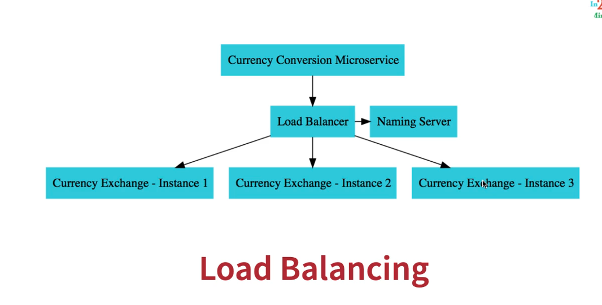

# Spring Cloud Microservices – Complete Cheat Sheet (with Java Code)


## Running application instance with different property
-------------------------------------------------------
1. mvn spring-boot:run -Dspring-boot.run.arguments="--server.port=9090"
2. java -jar target/app.jar --server.port=9090

3. with Intellij
   -Dserver.port=9090

4. Use different Spring Profiles (clean & reusable)
   application-dev.properties
   server.port=8081

   application-test.properties
   server.port=8082

        then
        Run the app with desired profile:
        java -jar app.jar --spring.profiles.active=dev


        or in IntelliJ set:

        --spring.profiles.active=dev
-----

quick :
resilence4J
-----------------

```<dependency>
  <groupId>io.github.resilience4j</groupId>
  <artifactId>resilience4j-spring-boot2</artifactId>
</dependency>

resilience4j.retry.instances.
                            sample-api.maxAttempts=5
                            sample-api.waitDuration=1s
                            sample-api.enableExponentialBackoff=true
                            sample-api.maxConcurrentCalls=10
                            default.limitForPeriod=2
                            default.limitRefreshPeriod=10s

resilience4j.retry.instances.sample-api.maxAttempts=5 #NEW
#resilience4j.retry.instances.sample-api.maxRetryAttempts=5 #OLD

resilience4j.retry.instances.sample-api.waitDuration=1s
resilience4j.retry.instances.sample-api.enableExponentialBackoff=true


#resilience4j.circuitbreaker.instances.default.failureRateThreshold=90

resilience4j.ratelimiter.instances.default.limitForPeriod=2
resilience4j.ratelimiter.instances.default.limitRefreshPeriod=10s


resilience4j.bulkhead.instances.default.maxConcurrentCalls=10
resilience4j.bulkhead.instances.sample-api.


```
Eureka client
--------------------

eureka.client.
              serviceUrl.defaultZone
              register-with-eureka=false

eureka.client.register-with-eureka=false
eureka.client.fetch-registry=false


API gateway
------------------

```
spring.cloud.gateway.discovery.locator.
                                           enabled=true
                                         lowerCaseServiceId=true
                                      fetch-registry=false

``` 
### FeignClient

------------------------------	
```
<groupId>org.springframework.cloud</groupId>
<artifactId>spring-cloud-starter-openfeign</artifactI

@FeignClient(name="currency-exchange")
```

																   
-------
### 1. Config Server
```xml
<parent>
    <groupId>org.springframework.boot</groupId>
    <artifactId>spring-boot-starter-parent</artifactId>
    <version>2.7.3</version>
</parent>

<properties>
    <java.version>21</java.version>
    <spring-cloud.version>2021.0.3</spring-cloud.version>
</properties>

<dependency>
<groupId>org.springframework.cloud</groupId>
<artifactId>spring-cloud-config-server</artifactId>
</dependency>


```

---


**Main class**
```java
@SpringBootApplication
@EnableConfigServer
public class SpringCloudConfigServerApplication {
    public static void main(String[] args) {
        SpringApplication.run(SpringCloudConfigServerApplication.class, args);
    }
}
```

**application.properties**
```properties
spring.application.name=spring-cloud-config-server
server.port=8888
spring.cloud.config.server.git.uri=file:///C:/git/config-repo
spring.cloud.config.server.git.default-label=main
```

---

## 2. Limits Service
```xml
<dependency>
<groupId>org.springframework.cloud</groupId>
<artifactId>spring-cloud-starter-config</artifactId>
</dependency>
<!--it contains below dependency -->
<dependency>
<groupId>org.springframework.cloud</groupId>
<artifactId>spring-cloud-config-client</artifactId>
</dependency>
```


**Limits.java**
```java
package com.in28minutes.microservices.limitsservice.bean;

public class Limits {
    private int minimum;
    private int maximum;

    public Limits() {}

    public Limits(int minimum, int maximum) {
        this.minimum = minimum;
        this.maximum = maximum;
    }

    public int getMinimum() { return minimum; }
    public void setMinimum(int minimum) { this.minimum = minimum; }
    public int getMaximum() { return maximum; }
    public void setMaximum(int maximum) { this.maximum = maximum; }
}
```

**Configuration.java**
```java
package com.in28minutes.microservices.limitsservice.configuration;

import org.springframework.boot.context.properties.ConfigurationProperties;
import org.springframework.stereotype.Component;

@Component
@ConfigurationProperties("limits-service")
public class Configuration {
    private int minimum;
    private int maximum;

    public int getMinimum() { return minimum; }
    public void setMinimum(int minimum) { this.minimum = minimum; }
    public int getMaximum() { return maximum; }
    public void setMaximum(int maximum) { this.maximum = maximum; }
}
```

**LimitsController.java**
```java
package com.in28minutes.microservices.limitsservice.controller;

import org.springframework.beans.factory.annotation.Autowired;
import org.springframework.web.bind.annotation.GetMapping;
import org.springframework.web.bind.annotation.RestController;
import com.in28minutes.microservices.limitsservice.bean.Limits;
import com.in28minutes.microservices.limitsservice.configuration.Configuration;

@RestController
public class LimitsController {

    @Autowired
    private Configuration configuration;

    @GetMapping("/limits")
    public Limits retrieveLimits() {
        return new Limits(configuration.getMinimum(), configuration.getMaximum());
    }
}
```

**application.properties**
```properties
spring.application.name=limits-service
spring.config.import=optional:configserver:http://localhost:8888
limits-service.minimum=3
limits-service.maximum=997
```

---

## 3. Spring Cloud Config Server – Git repo example files

**git-localconfig-repo/limits-service.properties**
```properties
limits-service.minimum=4
limits-service.maximum=996
```

**git-localconfig-repo/limits-service-dev.properties**
```properties
limits-service.minimum=4
limits-service.maximum=996
```

**git-localconfig-repo/limits-service-qa.properties**
```properties
limits-service.minimum=6
limits-service.maximum=993
```

---

## 4. Currency Exchange Service

**CurrencyExchange.java**
```java
package com.in28minutes.microservices.currencyexchangeservice;

import java.math.BigDecimal;
import javax.persistence.Column;
import javax.persistence.Entity;
import javax.persistence.Id;

@Entity
public class CurrencyExchange {

    @Id
    private Long id;

    @Column(name = "currency_from")
    private String from;

    @Column(name = "currency_to")
    private String to;

    private BigDecimal conversionMultiple;
    private String environment;

    public CurrencyExchange() {}

    public CurrencyExchange(Long id, String from, String to, BigDecimal conversionMultiple) {
        this.id = id;
        this.from = from;
        this.to = to;
        this.conversionMultiple = conversionMultiple;
    }

    // getters and setters omitted for brevity
}
```

**CurrencyExchangeRepository.java**
```java
package com.in28minutes.microservices.currencyexchangeservice;

import org.springframework.data.jpa.repository.JpaRepository;

public interface CurrencyExchangeRepository extends JpaRepository<CurrencyExchange, Long> {
    CurrencyExchange findByFromAndTo(String from, String to);
}
```

**CurrencyExchangeController.java**
```java
package com.in28minutes.microservices.currencyexchangeservice;

import org.springframework.beans.factory.annotation.Autowired;
import org.springframework.core.env.Environment;
import org.springframework.web.bind.annotation.GetMapping;
import org.springframework.web.bind.annotation.PathVariable;
import org.springframework.web.bind.annotation.RestController;

@RestController
public class CurrencyExchangeController {

    @Autowired
    private CurrencyExchangeRepository repository;

    @Autowired
    private Environment environment;

    @GetMapping("/currency-exchange/from/{from}/to/{to}")
    public CurrencyExchange retrieveExchangeValue(
            @PathVariable String from, @PathVariable String to) {

        CurrencyExchange currencyExchange = repository.findByFromAndTo(from, to);
        if (currencyExchange == null) {
            throw new RuntimeException("Unable to find data for " + from + " to " + to);
        }
        currencyExchange.setEnvironment(environment.getProperty("local.server.port"));
        return currencyExchange;
    }
}
```

**application.properties**
```properties
spring.application.name=currency-exchange
server.port=8000
spring.jpa.show-sql=true
spring.datasource.url=jdbc:h2:mem:testdb
spring.h2.console.enabled=true
spring.jpa.defer-datasource-initialization=true
```

**data.sql**
```sql
insert into currency_exchange (id,currency_from,currency_to,conversion_multiple,environment) values (10001,'USD','INR',65,'');
insert into currency_exchange (id,currency_from,currency_to,conversion_multiple,environment) values (10002,'EUR','INR',75,'');
insert into currency_exchange (id,currency_from,currency_to,conversion_multiple,environment) values (10003,'AUD','INR',25,'');
```

---

## 5. Currency Conversion Service

**CurrencyConversion.java**
```java
package com.in28minutes.microservices.currencyconversionservice;

import java.math.BigDecimal;

public class CurrencyConversion {
    private Long id;
    private String from;
    private String to;
    private BigDecimal quantity;
    private BigDecimal conversionMultiple;
    private BigDecimal totalCalculatedAmount;
    private String environment;

    // constructors, getters, setters
}
```

**CurrencyConversionController (RestTemplate)**
```java
package com.in28minutes.microservices.currencyconversionservice;

import java.math.BigDecimal;
import java.util.HashMap;
import org.springframework.http.ResponseEntity;
import org.springframework.web.bind.annotation.GetMapping;
import org.springframework.web.bind.annotation.PathVariable;
import org.springframework.web.bind.annotation.RestController;
import org.springframework.web.client.RestTemplate;

@RestController
public class CurrencyConversionController {

    @GetMapping("/currency-conversion/from/{from}/to/{to}/quantity/{quantity}")
    public CurrencyConversion calculateCurrencyConversion(
            @PathVariable String from,
            @PathVariable String to,
            @PathVariable BigDecimal quantity) {

        HashMap<String, String> uriVariables = new HashMap<>();
        uriVariables.put("from", from);
        uriVariables.put("to", to);

        ResponseEntity<CurrencyConversion> responseEntity = new RestTemplate()
            .getForEntity("http://localhost:8000/currency-exchange/from/{from}/to/{to}",
                          CurrencyConversion.class, uriVariables);

        CurrencyConversion currencyConversion = responseEntity.getBody();

        return new CurrencyConversion(
            currencyConversion.getId(),
            from, to, quantity,
            currencyConversion.getConversionMultiple(),
            quantity.multiply(currencyConversion.getConversionMultiple()),
            currencyConversion.getEnvironment() + " rest template"
        );
    }
}
```

---

## 6. Feign Client (should be inside currency conversion service)

**pom.xml dependency**
```xml
<dependency>
    <groupId>org.springframework.cloud</groupId>
    <artifactId>spring-cloud-starter-openfeign</artifactId>
</dependency>
```

**CurrencyExchangeProxy.java**
```java
package com.in28minutes.microservices.currencyconversionservice;

import org.springframework.cloud.openfeign.FeignClient;
import org.springframework.web.bind.annotation.GetMapping;
import org.springframework.web.bind.annotation.PathVariable;

@FeignClient(name="currency-exchange") // This should be name of application
// note: this is interface
public interface CurrencyExchangeProxy {

    @GetMapping("/currency-exchange/from/{from}/to/{to}")
    CurrencyConversion retrieveExchangeValue(
            @PathVariable("from") String from,
            @PathVariable("to") String to);
}
```

**Enable Feign in main**
```java
@SpringBootApplication
@EnableFeignClients("com.in28minutes.microservices.currencyconversionservice")
public class CurrencyConversionServiceApplication {}
```

**CurrencyConversionController (Feign)**
```java
@Autowired
private CurrencyExchangeProxy proxy;

@GetMapping("/currency-conversion-feign/from/{from}/to/{to}/quantity/{quantity}")
public CurrencyConversion calculateCurrencyConversionFeign(
        @PathVariable String from,
        @PathVariable String to,
        @PathVariable BigDecimal quantity) {
    // calling feign client here
    CurrencyConversion currencyConversion = proxy.retrieveExchangeValue(from, to);

    return new CurrencyConversion(currencyConversion.getId(),
            from, to, quantity,
            currencyConversion.getConversionMultiple(),
            quantity.multiply(currencyConversion.getConversionMultiple()),
            currencyConversion.getEnvironment() + " feign");
}
```

---

## 7. Eureka Naming Server

**Main**
```java
@SpringBootApplication
@EnableEurekaServer
public class NamingServerApplication {
    public static void main(String[] args) {
        SpringApplication.run(NamingServerApplication.class, args);
    }
}
```

**application.properties**
```properties
spring.application.name=naming-server
server.port=8761
eureka.client.register-with-eureka=false
eureka.client.fetch-registry=false
```

**Client config (each microservice)**
```properties
eureka.client.serviceUrl.defaultZone=http://localhost:8761/eureka
```

---

## 8. API Gateway (Spring Cloud Gateway)

**application.properties**
```properties
spring.application.name=api-gateway
server.port=8765
eureka.client.serviceUrl.defaultZone=http://localhost:8761/eureka
##Enable dynamic route generation from service registry
##If Eureka has a service called USER-SERVICE, then Gateway automatically adds a route:
##/USER-SERVICE/** → lb://USER-SERVICE
##This removes the need to manually define routes in application.yml.
spring.cloud.gateway.discovery.locator.enabled=true
##Generate route paths in lowercase (e.g., /user-service/**)
spring.cloud.gateway.discovery.locator.lowerCaseServiceId=true
```

**ApiGatewayConfiguration.java**
### API GATEWAY
``` 
http://localhost:8765/CURRENCY-EXCHANGE/currency-exchange/from/USD/to/INR
http://localhost:8765/CURRENCY-CONVERSION/currency-conversion/from/USD/to/INR/quantity/10
http://localhost:8765/CURRENCY-CONVERSION/currency-conversion-feign/from/USD/to/INR/quantity/10

http://localhost:8765/currency-exchange/currency-exchange/from/USD/to/INR
http://localhost:8765/currency-conversion/currency-conversion/from/USD/to/INR/quantity/10
http://localhost:8765/currency-conversion/currency-conversion-feign/from/USD/to/INR/quantity/10

http://localhost:8765/currency-exchange/from/USD/to/INR
http://localhost:8765/currency-conversion/from/USD/to/INR/quantity/10
http://localhost:8765/currency-conversion-feign/from/USD/to/INR/quantity/10
http://localhost:8765/currency-conversion-new/from/USD/to/INR/quantity/10
```
```java
package com.in28minutes.microservices.apigateway;

import org.springframework.cloud.gateway.route.RouteLocator;
import org.springframework.cloud.gateway.route.builder.RouteLocatorBuilder;
import org.springframework.context.annotation.Bean;
import org.springframework.context.annotation.Configuration;

@Configuration
public class ApiGatewayConfiguration {

    @Bean
    public RouteLocator gatewayRouter(RouteLocatorBuilder builder) {
        return builder.routes()
                .route(p -> p.path("/get")
                        .filters(f -> f.addRequestHeader("MyHeader","MyURI")
                                       .addRequestParameter("Param","MyValue"))
                        .uri("http://httpbin.org:80"))
                .route(p -> p.path("/currency-exchange/**")
                        .uri("lb://currency-exchange"))
                .route(p -> p.path("/currency-conversion/**")
                        .uri("lb://currency-conversion"))
                .route(p -> p.path("/currency-conversion-feign/**")
                        .uri("lb://currency-conversion"))
                .route(p -> p.path("/currency-conversion-new/**")
                        .filters(f -> f.rewritePath(
                                "/currency-conversion-new/(?<segment>.*)",
                                "/currency-conversion-feign/${segment}"))
                        .uri("lb://currency-conversion"))
                .build();
    }
}
```

**LoggingFilter.java**
```java
package com.in28minutes.microservices.apigateway;

import org.slf4j.Logger;
import org.slf4j.LoggerFactory;
import org.springframework.cloud.gateway.filter.GlobalFilter;
import org.springframework.stereotype.Component;
import org.springframework.web.server.ServerWebExchange;
import reactor.core.publisher.Mono;

@Component
public class LoggingFilter implements GlobalFilter {

    private Logger logger = LoggerFactory.getLogger(LoggingFilter.class);

    @Override
    public Mono<Void> filter(ServerWebExchange exchange, FilterChain chain) {
        logger.info("Path of the request received -> {}", exchange.getRequest().getPath());
        return chain.filter(exchange);
    }
}
```

---

## 9. Resilience4j (Circuit Breaker, Retry, RateLimiter, Bulkhead)

**pom.xml**
```xml
<dependency>
  <groupId>io.github.resilience4j</groupId>
  <artifactId>resilience4j-spring-boot2</artifactId>
</dependency>
<dependency>
  <groupId>org.springframework.boot</groupId>
  <artifactId>spring-boot-starter-aop</artifactId>
</dependency>
```

**CircuitBreakerController.java**
```java
package com.in28minutes.microservices.currencyexchangeservice;

import org.springframework.web.bind.annotation.GetMapping;
import org.springframework.web.bind.annotation.RestController;
import io.github.resilience4j.retry.annotation.Retry;

@RestController
public class CircuitBreakerController {


    @GetMapping("/sample-api")
    //@Retry(name = "sample-api", fallbackMethod = "hardcodedResponse")
    //@CircuitBreaker(name = "default", fallbackMethod = "hardcodedResponse")
    //@RateLimiter(name="default") // number of request per second
    @Bulkhead(name="sample-api") // number of concurrent reqs per second
    //10s => 10000 calls to the sample api
    public String sampleApi() {
        logger.info("Sample api call received");
//		ResponseEntity<String> forEntity = new RestTemplate().getForEntity("http://localhost:8080/some-dummy-url", 
//					String.class);
//		return forEntity.getBody();
        return "sample-api";
    }

    public String hardcodedResponse(Exception ex) {
        return "fallback-response";
    }
}
```

**application.properties**
```properties
resilience4j.retry.instances.sample-api.maxAttempts=5
resilience4j.retry.instances.sample-api.waitDuration=1s
resilience4j.retry.instances.sample-api.enableExponentialBackoff=true

resilience4j.ratelimiter.instances.default.limitForPeriod=2
resilience4j.ratelimiter.instances.default.limitRefreshPeriod=10s

resilience4j.bulkhead.instances.sample-api.maxConcurrentCalls=10
```

---

## 10. Tips & Debugging

- Config Server: check `spring.application.name`, repo path, file names and labels (`main` vs `master`).
- Feign: ensure `@EnableFeignClients` and correct `@PathVariable("from") String from` annotations.
- Eureka: start naming server first, then services; check service registration at `http://localhost:8761`.
- API Gateway: use discovery locator or explicit routes; enable wiretap for debugging:
```properties
spring.cloud.gateway.httpserver.wiretap=true
spring.cloud.gateway.httpclient.wiretap=true
```

---

## 11. Useful URLs

- Limits: `http://localhost:8080/limits`
- Config Server: `http://localhost:8888/limits-service/default`
- Currency Exchange: `http://localhost:8000/currency-exchange/from/USD/to/INR`
- Currency Conversion: `http://localhost:8100/currency-conversion/from/USD/to/INR/quantity/10`
- Eureka: `http://localhost:8761/`
- API Gateway: `http://localhost:8765/currency-exchange/from/USD/to/INR`

---

*Generated for quick revision and interview preparation.*
