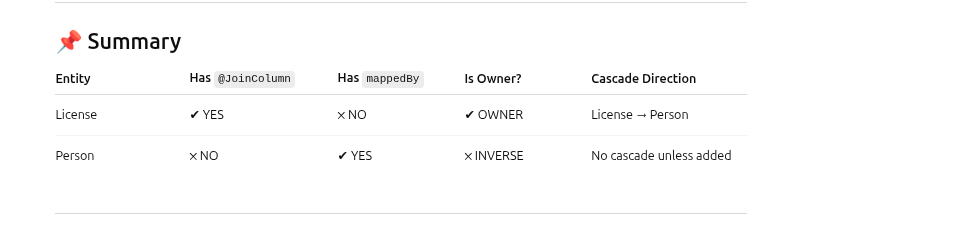
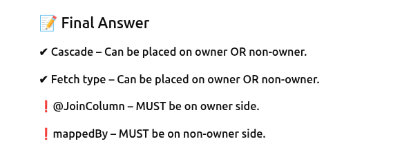
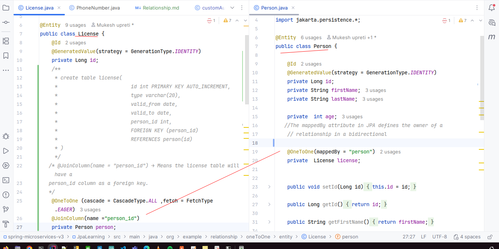
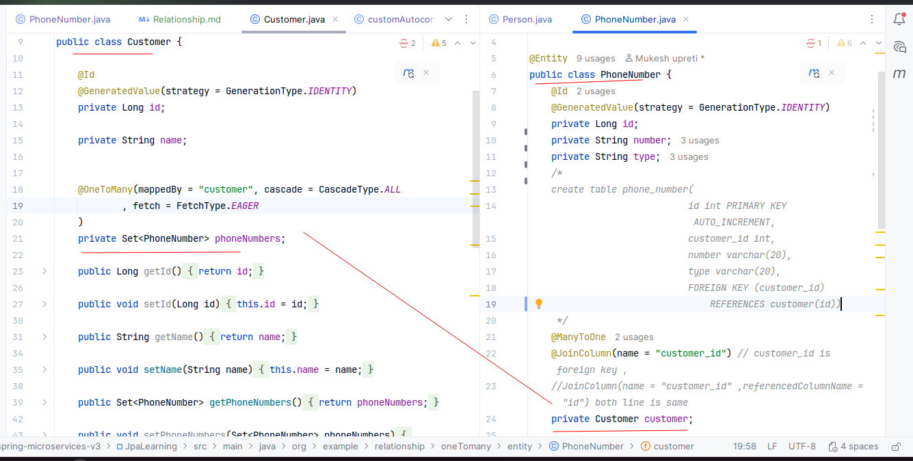
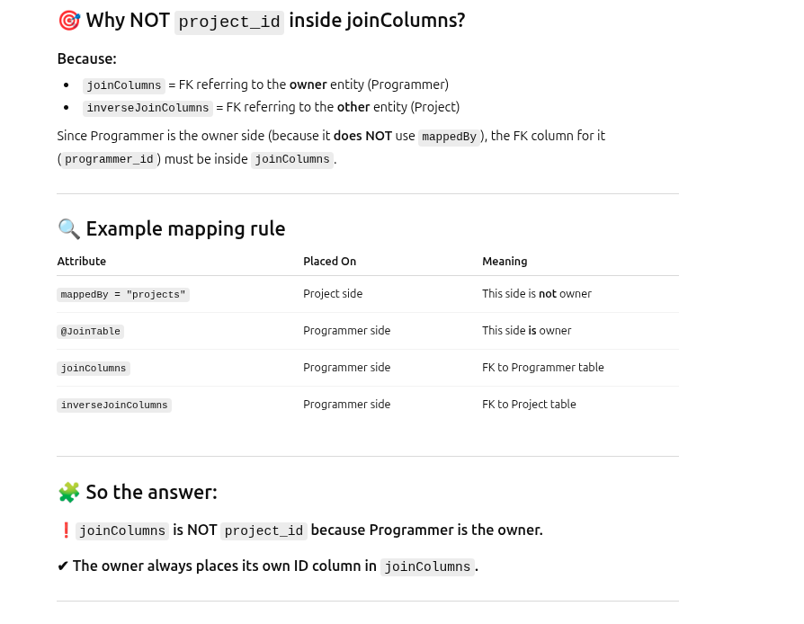

1. one to one :  Person   Licence(R) 
2. one to Many:  customer phonenumber(R)
3. Many to Many: Project Programmer(R)
### one to One (instance variable where mapped by is there is owner entity to relation will maintain in that table Eg: here Licence)

### one to Many

### Many to Many

