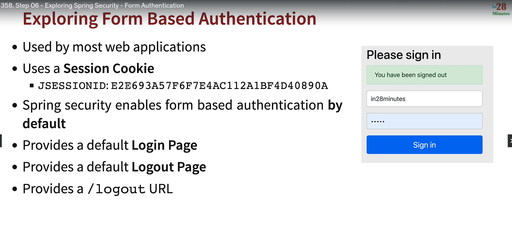
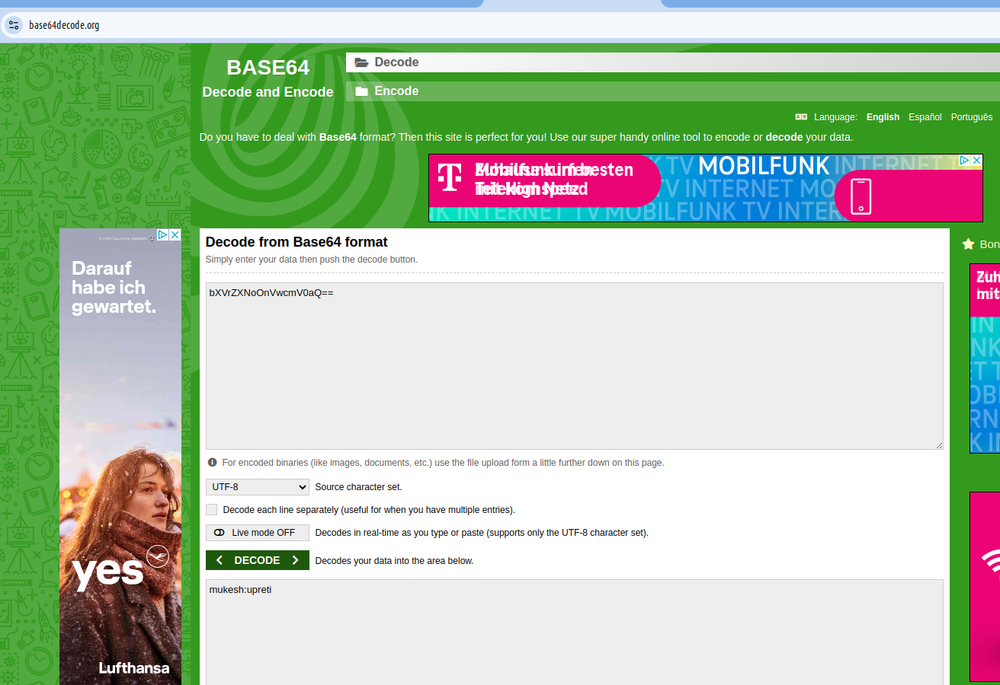
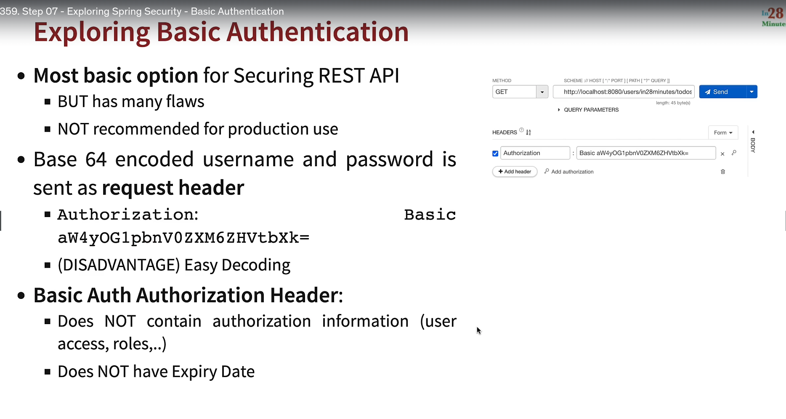

Notes :

By default, every thing is proteced in spring security
Even for non-existing urls if defualt
security is enabled they are under spring
secuirty. Spring secuirty after authentication
only will tell weather if they are existing.

Spring secuirty by default provide login form
logout form (form based authetication)

Spring secuirty Filter intercept request
even before Dispatcher servelet (which handle
all the request.)

basic authenication is not secured as it uses base 64 enconding

1. which can be decode easliy
2. it not have any expiry
   
   

