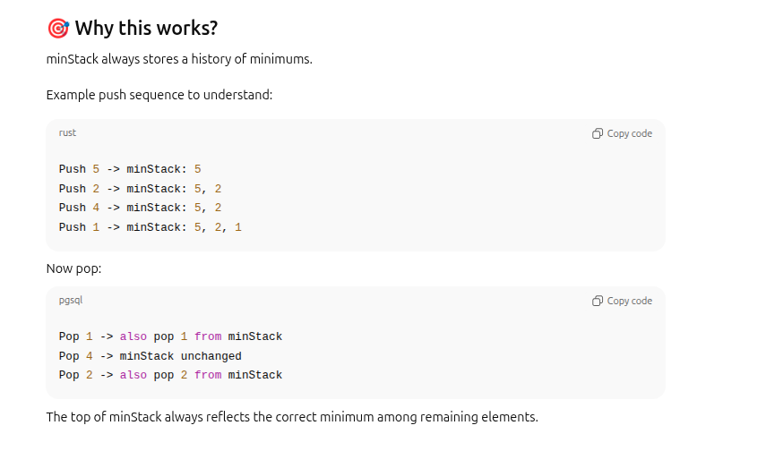
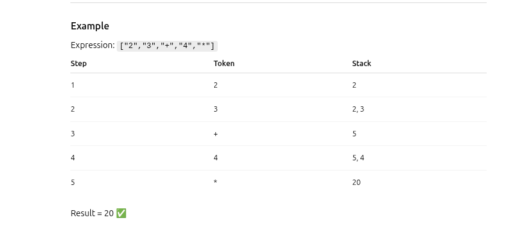
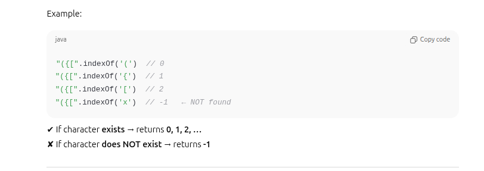
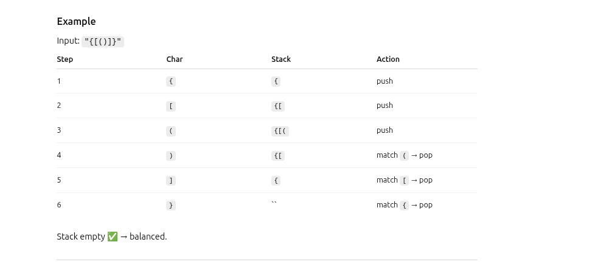
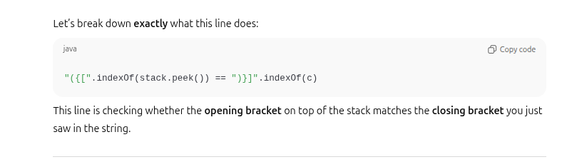
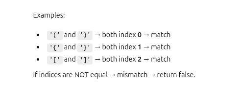
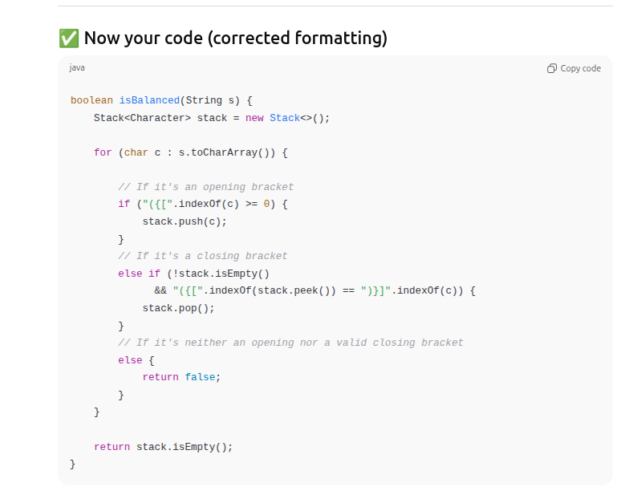

# LinkedList & Stack Algorithms Cheat Sheet (Java)

## LinkedList Algorithms

### 1. Reverse a LinkedList
**Idea:** Use three pointers to reverse links.
```java
ListNode reverse(ListNode head) {
    ListNode prev = null, curr = head;
    while (curr != null) {
        ListNode next = curr.next;
        curr.next = prev;
        prev = curr;
        curr = next;
    }
    return prev;
} 
```


### 2. Detect Cycle (Floyd’s Tortoise & Hare)
```java
```
Idea: Slow and fast pointers; meet indicates cycle.
```java
boolean hasCycle(ListNode head) {
    ListNode slow = head, fast = head;
    while (fast != null && fast.next != null) {
        slow = slow.next;
        fast = fast.next.next;// this can through nullpointerEx fast.next != null due to  this line
        if (slow == fast) return true;
    }
    return false;
}

```

### 3. Find Middle Node

Idea: Slow moves 1x, fast moves 2x.
```java
ListNode middleNode(ListNode head) {
    ListNode slow = head, fast = head;
    while (fast != null && fast.next != null) {
        slow = slow.next;
        fast = fast.next.next;
    }
    return slow;
}

```
### 4. Merge Two Sorted LinkedLists
```java
ListNode mergeTwoLists(ListNode l1, ListNode l2) {
    ListNode dummy = new ListNode(0), curr = dummy;
    while (l1 != null && l2 != null) {
        if (l1.val < l2.val) { curr.next = l1; l1 = l1.next; }
        else { curr.next = l2; l2 = l2.next; }
        curr = curr.next;
    }
    curr.next = (l1 != null) ? l1 : l2;
    return dummy.next;
}

```
### 5. Remove N-th Node From End
**solution**: 
    We create two pointers (first and second) that start from the same place.
    Then we move first ahead by N+1 steps.(**Because we want second to stop one node before the one we need to remove.**)


**Why this is wokring**
    second(0) ---gap is n+1 =(n+1-0)---First(n+1)
    so when first reaches null , second will reach n th node from end
```java
ListNode removeNthFromEnd(ListNode head, int n) {
    ListNode dummy = new ListNode(0);
    dummy.next = head;
    ListNode first = dummy, second = dummy;
    for (int i = 0; i <= n; i++) first = first.next;
    while (first != null) { first = first.next; second = second.next; }
    second.next = second.next.next;
    return dummy.next;
}

```
## Stack Algorithms
### 1. Implement Stack Using Array
```java
class MyStack {
    int[] arr; int top = -1;
    MyStack(int size) { arr = new int[size]; }
    void push(int x) { arr[++top] = x; }
    int pop() { return arr[top--]; }
    int peek() { return arr[top]; }
    boolean isEmpty() { return top == -1; }
}

```

### 2. Implement Stack Using LinkedList // have head pointet to keep track of top. very similar to linkedlist reverse
```java
class StackNode { int val; StackNode next; }
class MyStack {
    StackNode head; // top of the stack .first time is null and every time we push we create new node and point it to head and update head to new node
    void push(int x) { StackNode node = new StackNode(); node.val = x; node.next = head; head = node; }
    int pop() { int val = head.val; head = head.next; return val; }
    int peek() { return head.val; }
    boolean isEmpty() { return head == null; }
}

```

### 3. Min Stack (Track Minimum)

Idea: Use auxiliary stack for min.
We maintain two stacks:

stack – holds all values (normal stack)

minStack – holds the minimum values seen so far

This way, the minimum element at any time is simply the top of minStack, giving O(1) getMin().

```java
class MinStack {
    Stack<Integer> stack = new Stack<>(), minStack = new Stack<>();
    void push(int x) { stack.push(x); if (minStack.isEmpty() || x <= minStack.peek()) minStack.push(x); }
    void pop() { if (stack.pop().equals(minStack.peek())) minStack.pop(); }
    int top() { return stack.peek(); }
    int getMin() { return minStack.peek(); }
}

```

### 4. Evaluate Postfix Expression

Idea: Stack operands, apply operators.
Postfix notation recap

In postfix (Reverse Polish Notation), operators come after operands.

Example: ["2","3","+","4","*"] → equivalent to (2+3)*4.



```java
int evalPostfix(String[] tokens) {
    Stack<Integer> stack = new Stack<>();
    for (String t : tokens) {
        if ("+-*/".contains(t)) {
            int b = stack.pop(), a = stack.pop();
            switch(t) {
                case "+": stack.push(a+b); break;
                case "-": stack.push(a-b); break;
                case "*": stack.push(a*b); break;
                case "/": stack.push(a/b); break;
            }
        } else stack.push(Integer.parseInt(t));
    }
    return stack.pop();
}

```

### 5. Check Balanced Parentheses







```java
boolean isBalanced(String s) {
    Stack<Character> stack = new Stack<>();
    for (char c : s.toCharArray()) {
        if ("({[".indexOf(c) >= 0) stack.push(c);
        else if (!stack.isEmpty() && "({[".indexOf(stack.peek()) == ")}]".indexOf(c)) stack.pop();
        else return false;
    }
    //After processing the whole string:
    //If stack is empty → all opening brackets found matching closing brackets → balanced.
    //If stack is not empty → some opening brackets were never closed → not balanced.
    return stack.isEmpty();
}

```


### 6. next
```java
```
