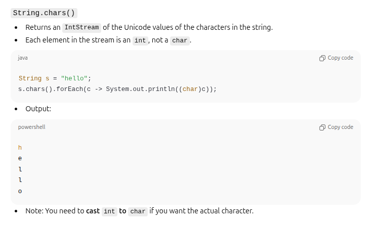

# String Algorithms Cheat Sheet (Java)

**String methods**



## 1. Reverse a String

**Explanation:** Reverse characters manually or using built‑in
utilities.\
**Solution:**

``` java
String reverse(String s) {
    return new StringBuilder(s).reverse().toString();
}
```


## 2. Check Palindrome

**Explanation:** Compare string with its reverse or use two pointers.\
**Solution:**

``` java
boolean isPalindrome(String s) {
    int i=0, j=s.length()-1;
    while (i<j)
        if (s.charAt(i++) != s.charAt(j--)) return false;
    return true;
}
```

## 3. First Non‑Repeating Character

**Explanation:** Count occurrences using a map; return first with count
1.\
**Solution:**

``` java
char firstNonRepeating(String s) {
    int[] freq = new int[256];   // frequency table

    // Count occurrences
    for (char c : s.toCharArray()) {
        freq[c]++;
    }

    // Find first non-repeating
    for (char c : s.toCharArray()) {
        if (freq[c] == 1) {
            return c;
        }
    }

    return '\0';  // means "no non-repeating character"
}


char firstNonRepeating(String s) {
    return s.chars()
            .mapToObj(c -> (char) c)
            .collect(Collectors.groupingBy(
                    c -> c, LinkedHashMap::new, Collectors.counting()
            ))
            .entrySet()
            .stream()
            .filter(e -> e.getValue() == 1)
            .map(Map.Entry::getKey)
            .findFirst()
            .orElse('\0');  // no non-repeating char
}

How it works:

Convert string → stream of chars

Group by character with counting

Maintain input order using LinkedHashMap

Pick the first character whose count = 1

Return '\0' if none exists
```

## 4. Anagram Check

**Explanation:** Sort or compare character counts.\
**Solution:**
Two strings a and b are anagrams if:
They have the same characters
with the same frequencies

…in any order
``` java
boolean isAnagram(String a, String b) {
    if (a.length()!=b.length()) return false;
    int[] freq = new int[256];
    for (char c : a.toCharArray()) freq[c]++;
    for (char c : b.toCharArray()) if (--freq[c] < 0) return false;
    return true;
}
```

## 5. Count Vowels & Consonants

**Explanation:** Iterate and classify.\
**Solution:**

``` java
int countVowels(String s) {
    int c=0;
    for (char ch: s.toLowerCase().toCharArray())
        if ("aeiou".indexOf(ch)>=0) c++;
    return c;
}
```

## 6. Longest Common Prefix

**Explanation:** Compare characters across all strings.\
**Solution:**

``` java
String longestCommonPrefix(String[] arr) {
    String p = arr[0];
    for (int i=1;i<arr.length;i++) {
        while (!arr[i].startsWith(p))
            p = p.substring(0, p.length()-1);
    }
    return p;
}
```

## 7. Longest Palindromic Substring (Expand Around Center)

**Explanation:** Expand from each index as center.\
**Solution:**

``` java
String longestPalindrome(String s) {
    if (s==null || s.length()<2) return s;
    int start=0, end=0;
    for (int i=0;i<s.length();i++) {
        int len = Math.max(expand(s,i,i), expand(s,i,i+1));
        if (len > end-start) {
            start = i - (len-1)/2;
            end = i + len/2;
        }
    }
    return s.substring(start,end+1);
}
int expand(String s,int l,int r){
    while(l>=0 && r<s.length() && s.charAt(l)==s.charAt(r)){ l--; r++; }
    return r-l-1;
}
```

## 8. String Compression (aabb → a2b2)

**Explanation:** Count consecutive characters.\
**Solution:**

``` java
String compress(String s) {
    StringBuilder sb=new StringBuilder();
    int count=1;
    for (int i=1;i<=s.length();i++){
        if (i==s.length() || s.charAt(i)!=s.charAt(i-1)) {
            sb.append(s.charAt(i-1)).append(count);
            count=1;
        } else count++;
    }
    return sb.toString();
}
```

## 9. Remove Duplicates

**Explanation:** Track seen characters.\
**Solution:**

``` java
String removeDuplicates(String s) {
    boolean[] seen = new boolean[256];
    StringBuilder sb = new StringBuilder();
    for (char c: s.toCharArray())
        if (!seen[c]) { seen[c] = true; sb.append(c); }
    return sb.toString();
}
```

## 10. Longest Substring Without Repeating Characters

**Explanation:** Sliding window with index tracking.\
**Solution:**

``` java
int longestUniqueSubstring(String s) {
    int[] idx = new int[256];
    Arrays.fill(idx, -1);
    int left=0, max=0;
    for (int i=0;i<s.length();i++) {
        char c=s.charAt(i);
        if (idx[c] >= left) left = idx[c] + 1;
        idx[c] = i;
        max = Math.max(max, i-left+1);
    }
    return max;
}
```
