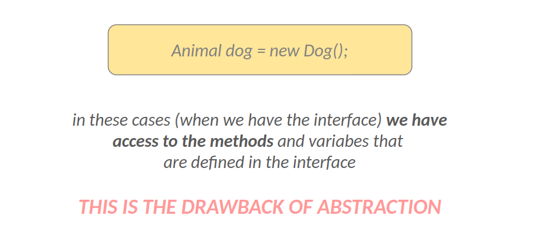
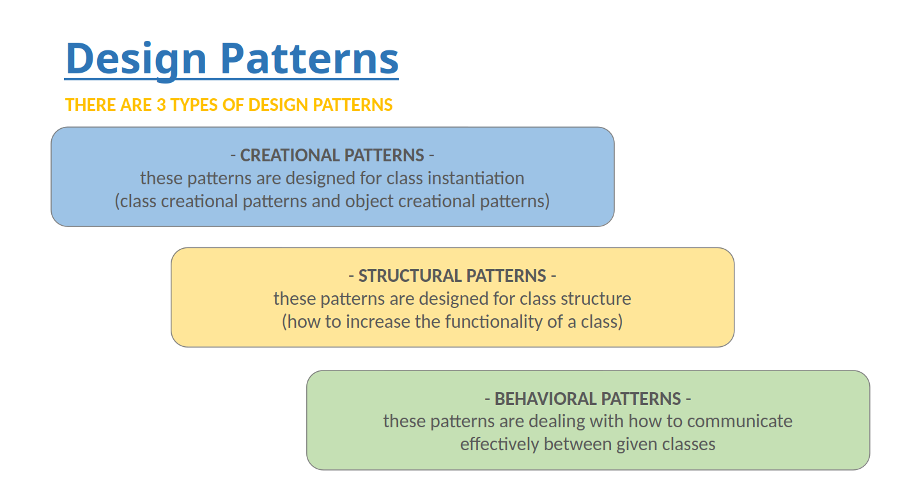
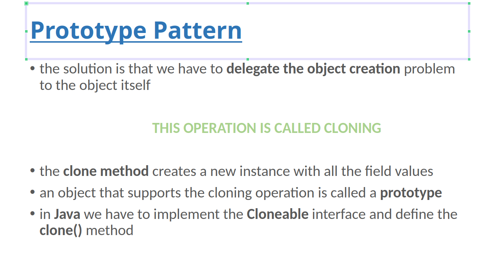
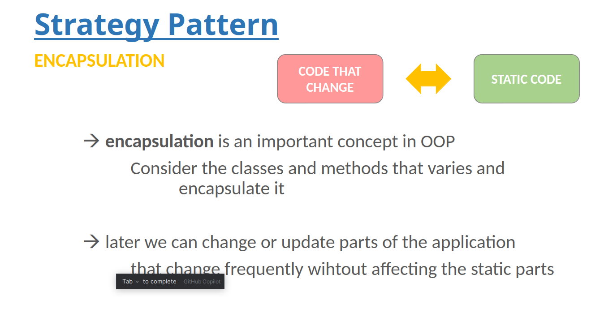
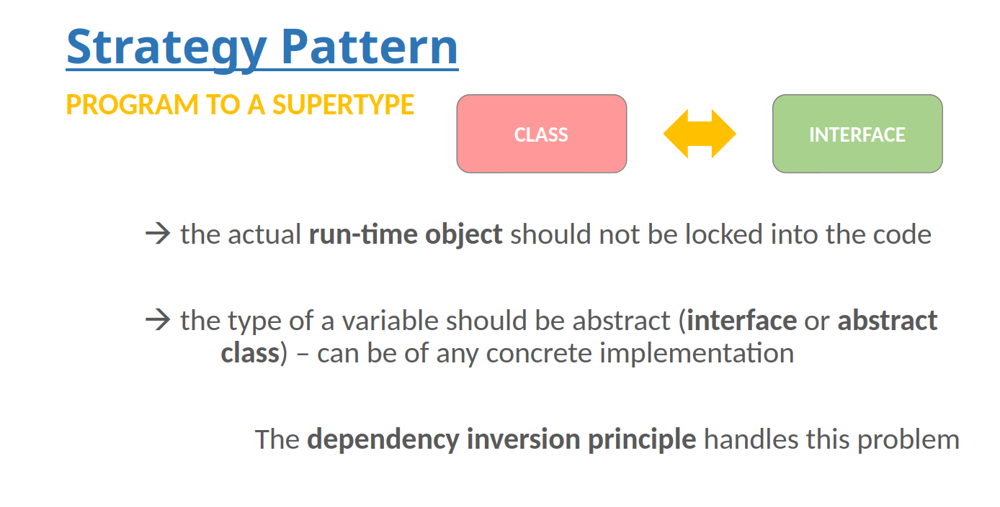
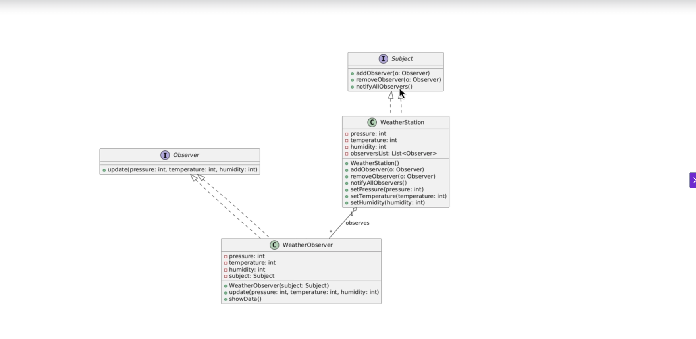
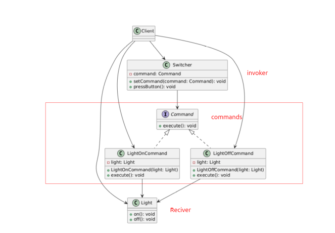

#### solid Pattern are specification and Design patterns are its implementation.

## All the SOLID priciple are closly related to each other if you satisfied/voildate one other get satisfied

### Single Responsibility
motivation:
If class has too many resposibilty that It will have tight coupling.
to make class loose coupling each resposibilty shoudld be handeled by different system.
### open close (using abstraction/interfacesx) (stregtgy and template)
Minimise change to existing code while updating code for adding new feature 
as existing code is unit and integration tested
It is closely related to single resposibility priciple as if class is doing one
resposibility then it easier to extend it without changing it.
So if voilate SRP then it will also voilate open close.

How ; class should not extend another class . A common interface should be define.

### Liskov Subsitution Principal.(stregtgy and template)
Motivation: We create lot of drived class. If subclass object will is behaviour
wise same as superclass then it can be replaced easily without affecting stablity
of existing code.
if you break it that also mean you break SRP and open close priciple.(first class have single resposibility)and it is open for extenstion. so if subclass change behaviour of superclass then it will voilate LSP.
(if now followed your class break extensitbility)
### Interface Segrigate principal.
Fat interface should break into smaller interface by using
extend interface so that client are not forced all.

### Dependecy (inversion of control)
Holiwold principal. you dont call us we will call you.
So dependency are intject by outside to the application.
high level module should not depend on low level module both should depend on abstraction.

SOLID Design patterns are specification and Design 
patterns are its implementation.

## open close principle of Denpendency inversion principle can be^ implemented using following design patterns:

## singleaton: 
controled access (dabaseconnection logger)
## Factory pattern : 
creating instance using new kebword is tightly coupled(less flexibile) so factory pattern.(abstration are used to create object) (we should favor abstraction(supertype) over concreate implementation)
Animal a=new Dog(); // tightly coupled
Animal a=AnimalFactory.getAnimal("dog"); //loosely coupled.
Factory pattern introduces cyclomatic complexity (so many if else or switch case) do harder to test

## Abstract factory pattern:
when we have family of related object to create.

Factory and abstratct factory pattern are no logger useful due to two much if else or switch case. which increase cyclomatic complexity. 
Modern way to do it is using dependency injection framework like spring. which uses reflection to create object at runtime. not if else or switch case.
## Builder pattern:
when we have complex object to create with many optional parameter which create lot of constructor overloading. other thing is telescoping constructor anti pattern.and it create immutable object. so it is number one pattern to create immutable object.
Person p=new Person.PersonBuilder("name")
                .setAge(10)
                .setAddress("address")
                .build();
in the build method we create actual object.

## Prototype pattern:
when creating object is costly in term of time and resource.so we create object by cloning existing object.
Person p1=new Person();
Person p2=p1.clone(); //shallow copy
Person p3=p1.deepClone(); //deep copy

#### Behavioral Design patters

## Stregty pattern: (implements open close principle )
when we have multiple algorithm for same task and we want to choose algorithm at runtime.
eg: sorting algorithm(quick sort,merge sort,bubble sort)

reduce cyclomatic complexity by using polymorphism instead of if else or switch case.   

## Observer pattern:
when we have one to many relationship between object so that when one object change state all its dependents are notified and updated automatically. it is also called publish subscribe pattern.
eg: event management system,stock market system.It create loose coupling between object.

## Command pattern:
Satisfied open close principle.
support undo redo operation.
invoker: object that knows how to execute a command but doesn't know anything about a concrete command, it only knows about command interface.(contains reference of command interface)
command: declare interface for executing a command.(it have reference of receiver object)
concrete command: defines a binding between a receiver object and an action. implements execute by invoking corresponding operation(s) on receiver.
receiver: knows how to perform the operations associated with carrying out a request. any class may serve as a receiver.
client: creates a concrete command object and sets its receiver.

Encapsulate a request as an object thereby letting you parameterize clients with different requests, queue or log requests, and support undoable operations.
eg: menu item in resturant ordering system, remote control system.

## Template design patter

### Structural design
in software engineering structural design patterns are about how classes and objects can be composed to form larger structures. The structural design patterns simplifies the structure of software components by identifying the relationships between them.

### decorate pattern

### Fascade

## Adapter

