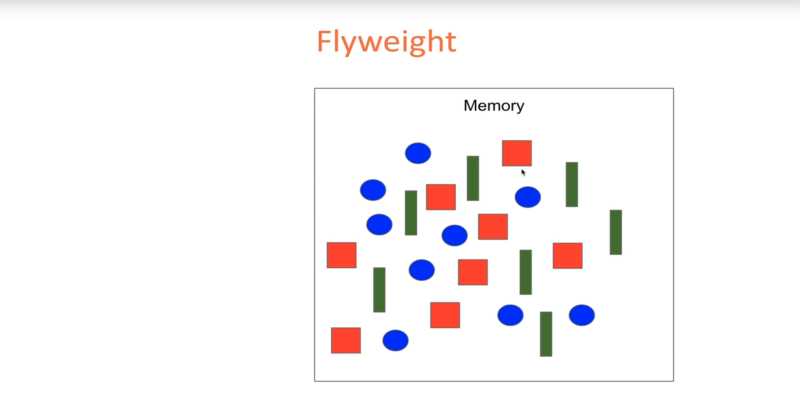
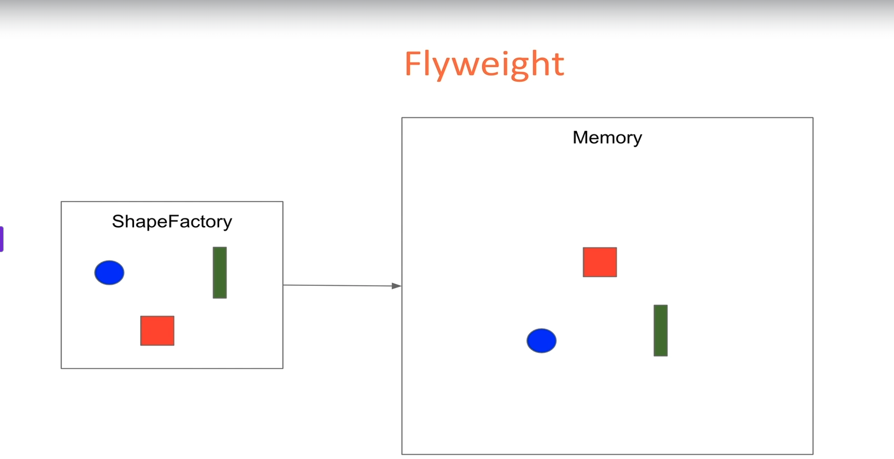
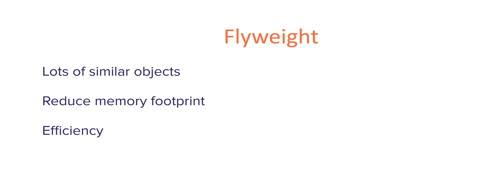

#### The Flyweight Pattern is a structural design pattern used to reduce memory usage by sharing as much data as possible with similar objects. It’s particularly useful when dealing with a large number of objects that share common data.