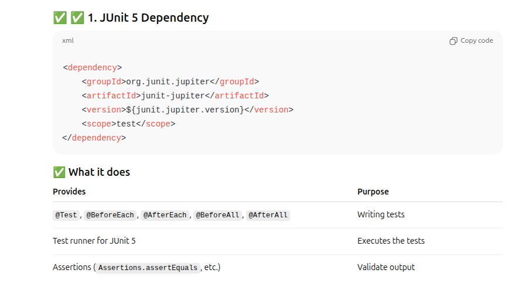
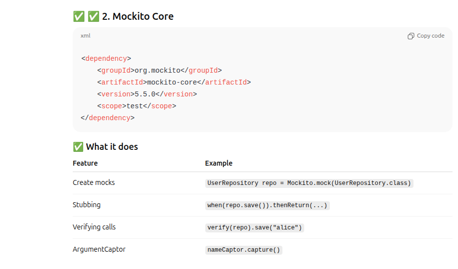
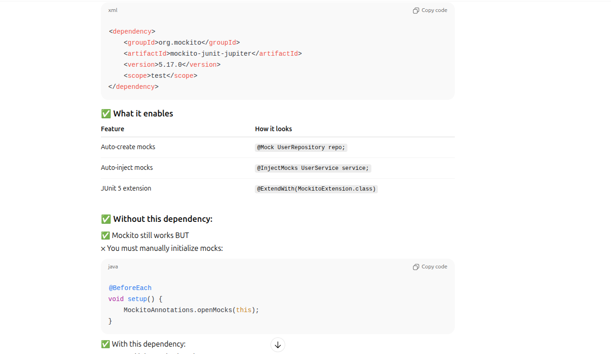
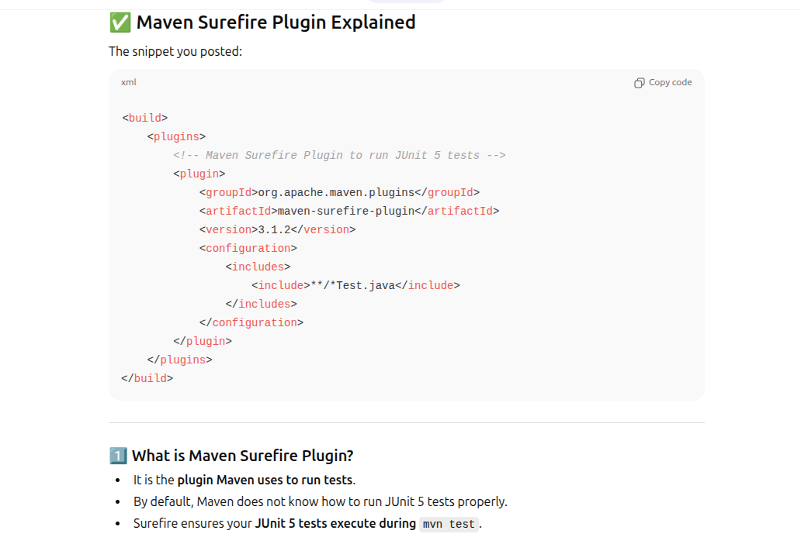
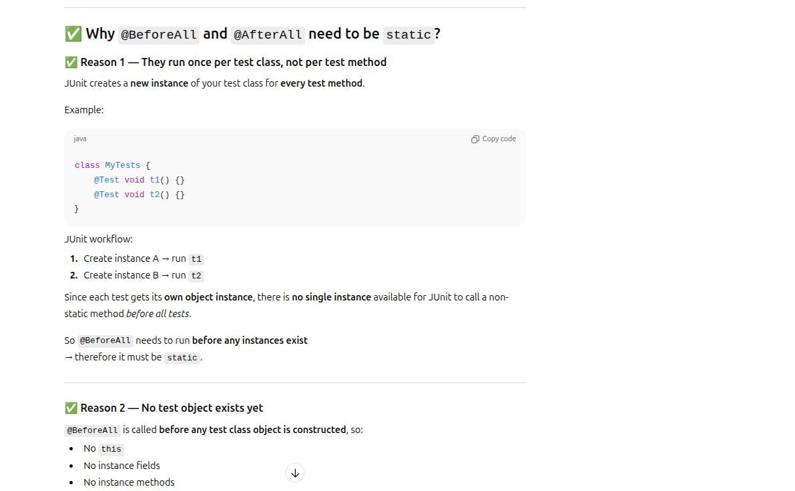
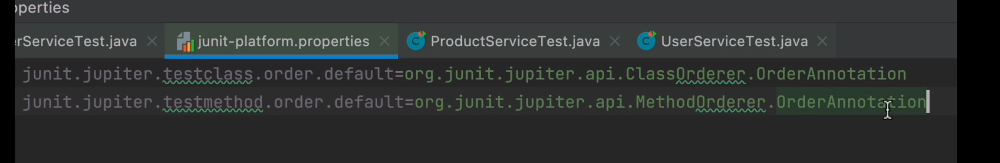
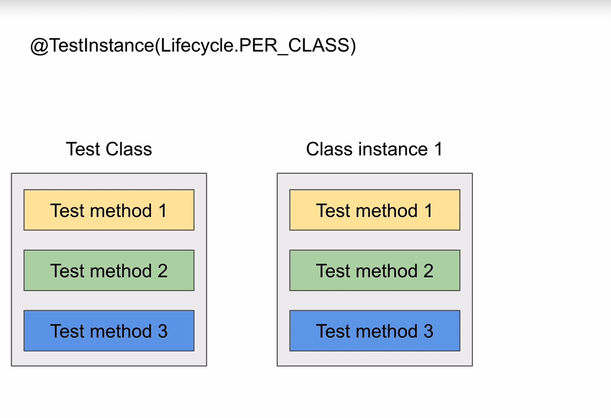
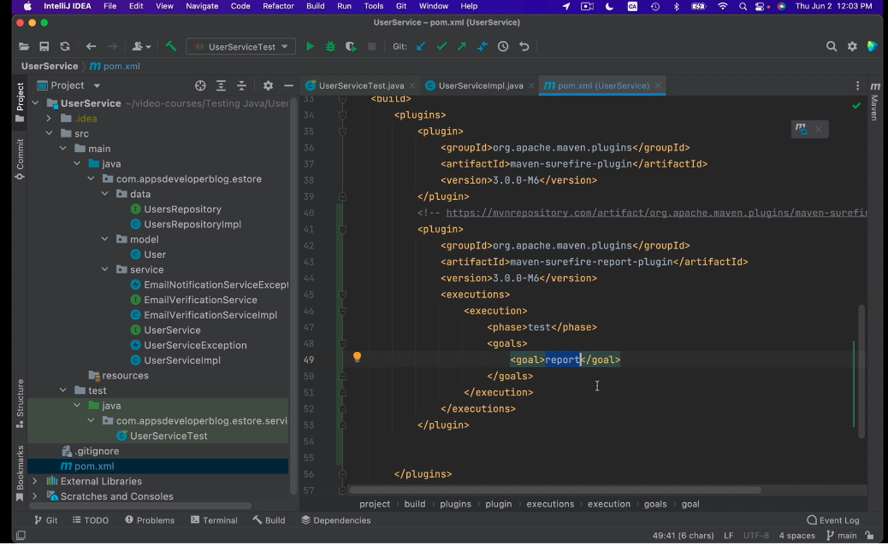
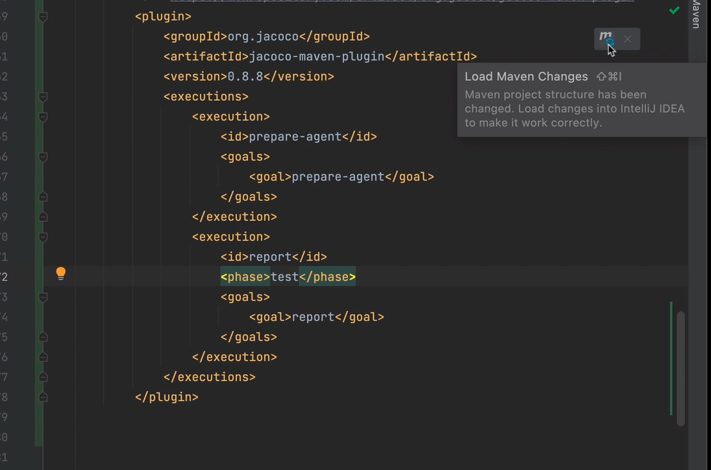

Before start 
pom.xml







```xml
<?xml version="1.0" encoding="UTF-8"?>
<project xmlns="http://maven.apache.org/POM/4.0.0"
xmlns:xsi="http://www.w3.org/2001/XMLSchema-instance"
xsi:schemaLocation="http://maven.apache.org/POM/4.0.0 http://maven.apache.org/xsd/maven-4.0.0.xsd">
<modelVersion>4.0.0</modelVersion>

    <groupId>org.example</groupId>
    <artifactId>junit</artifactId>
    <version>1.0-SNAPSHOT</version>

    <properties>
        <maven.compiler.source>21</maven.compiler.source>
        <maven.compiler.target>21</maven.compiler.target>
        <junit.jupiter.version>5.10.0</junit.jupiter.version>
    </properties>
    <dependencies>
        <!-- JUnit 5 API and Engine -->
        <dependency>
            <groupId>org.junit.jupiter</groupId>
            <artifactId>junit-jupiter</artifactId>
            <version>${junit.jupiter.version}</version>
            <scope>test</scope>
        </dependency>

        <!-- Optional: Mockito for mocking if needed in future exercises -->
        <dependency>
            <groupId>org.mockito</groupId>
            <artifactId>mockito-core</artifactId>
            <version>5.5.0</version>
            <scope>test</scope>
        </dependency>
        <dependency>
            <groupId>org.mockito</groupId>
            <artifactId>mockito-junit-jupiter</artifactId>
            <version>5.17.0</version>
            <scope>test</scope>
        </dependency>
    </dependencies>

    <build>
        <plugins>
            <!-- Maven Surefire Plugin to run JUnit 5 tests -->
            <plugin>
                <groupId>org.apache.maven.plugins</groupId>
                <artifactId>maven-surefire-plugin</artifactId>
                <version>3.1.2</version>
            </plugin>
        </plugins>
    </build>
</project>
```
## org.junit.jupiter 
      junit-jupiter
## org.mockito
    mockito-core
    mockito-junit-jupiter
# ✅ JUnit 5 + Mockito Cheat Sheet

## ✅ JUnit 5 Annotations
| Annotation           | Purpose |
|----------------------|---------|
| `@Test`              | Marks a test method |
| `@BeforeEach`        | Runs before each test (init state) |
| `@AfterEach`         | Runs after each test (cleanup) |
| `@BeforeAll`         | Runs once before all tests (**static**) |
| `@AfterAll`          | Runs once after all tests (**static**) |
| `@DisplayName`       | Sets readable test name |
| `@Disabled`          | Skips test |
| `@ParameterizedTest` | Runs same test with different inputs |
| `@ValueSource`       | Parameterized source (ints, strings, etc.) |
| `@CsvSource`         | Multiple params per invocation | 
| `@Nested`            | Groups logical test cases |
| `@Tag`               | Category tag (unit, slow, integration) |
| `@Timeout`           | Test must finish within time |
| `@RepeatedTest`      | Run same test multiple times |

---

## ✅ Mockito Annotations
| Annotation | Purpose |
|------------|---------|
| `@Mock` | Creates a mock object |
| `@Spy` | Real object but method override allowed |
| `@InjectMocks` | Injects mocks into class under test |
| `@Captor` | Captures arguments passed to mocks |
| `@ExtendWith(MockitoExtension.class)` | Enables Mockito in JUnit 5 |

---
| Purpose | Example |
|--------|---------|
| **Basic verify (called once)** | `verify(mock).doSomething();` |
| **Verify with arguments** | `verify(mock).send("hello");` |
| **Verify exact number of calls** | `verify(mock, times(2)).run();` |
| **Verify zero calls** | `verify(mock, never()).run();` |
| **Verify at least once** | `verify(mock, atLeastOnce()).run();` |
| **Verify at least N times** | `verify(mock, atLeast(3)).run();` |
| **Verify at most N times** | `verify(mock, atMost(2)).run();` |
| **Verify no interactions** | `verifyNoInteractions(mock);` |
| **Verify no more interactions** | `verifyNoMoreInteractions(mock);` |
| **Verify call order** | `InOrder in = inOrder(m1, m2); in.verify(m1).start(); in.verify(m2).finish();` |
| **Verify with matchers** | `verify(service).save(any());` |
| **Verify mixed matchers** | `verify(service).update(eq("id"), anyInt());` |
| **Verify async with timeout** | `verify(mock, timeout(1000)).load();` |
| **Verify async + count** | `verify(mock, timeout(1000).times(2)).load();` |
| **Verify never called with specific arg** | `verify(mock, never()).save(eq("bad"));` |
| **ArgumentCaptor** | `var c = ArgumentCaptor.forClass(String.class); verify(s).send(c.capture());` |
| **Verify void method** | `verify(mock).delete("123");` |
| **Throw exception using doThrow() (void methods)** | `doThrow(new RuntimeException()).when(mock).delete("x");` |
| **Throw exception using when().thenThrow() (non-void)** | `when(service.load("x")).thenThrow(new IOException());` |
| **Mock/stub return value with when()** | `when(service.getName()).thenReturn("John");` |
## ✅ Full Example Covering Almost Everything

```java
import org.junit.jupiter.api.*;
import org.junit.jupiter.api.extension.ExtendWith;
import org.junit.jupiter.params.ParameterizedTest;
import org.junit.jupiter.params.provider.ValueSource;
import org.junit.jupiter.params.provider.CsvSource;
import org.mockito.*;
import java.util.*;

@ExtendWith(MockitoExtension.class)
@Tag("unit")
class UserServiceTest {

    // ------- Mockito components -------
    @Mock
    UserRepository repository;

    @Spy
    ArrayList<String> spyList = new ArrayList<>();

    @InjectMocks
    UserService service;

    @Captor
    ArgumentCaptor<String> nameCaptor;

    // ------- JUnit lifecycle -------
    @BeforeAll
    static void setupAll() {
        System.out.println("== Runs once before all tests ==");
    }

    @BeforeEach
    void setup() {
        System.out.println("== Runs before each test ==");
    }

    @AfterEach
    void tearDown() {
        System.out.println("== Runs after each test ==");
    }

    @AfterAll
    static void cleanupAll() {
        System.out.println("== Runs once after all tests ==");
    }

    // ------- Basic Test -------
    @Test
    @DisplayName("Should save user successfully")
    void testSaveUser() {
        service.addUser("alice");
        verify(repository).save(nameCaptor.capture());
        Assertions.assertEquals("alice", nameCaptor.getValue());
    }

    // ------- Disabled Test -------
    @Test
    @Disabled("Feature not implemented yet")
    void disabledTest() {
        Assertions.fail("Should not run");
    }

    // ------- Parameterized - Single Input -------
    @ParameterizedTest
    @ValueSource(strings = {"bob", "john", "mark"})
    void testAddUser_MultipleValues(String name) {
        service.addUser(name);
        verify(repository).save(name);
    }

    // ------- Parameterized - CSV -------
    @ParameterizedTest
    @CsvSource({
        "sam, true",
        "kate, true",
        " '', false"
    })
    void testValidateUser(String name, boolean expected) {
        Assertions.assertEquals(expected, service.isValid(name));
    }

    // ------- Testing exception -------
    @Test
    void testExceptionThrown() {
        // void returning method
        Mockito.doThrow(new IllegalArgumentException())
                .when(repository).save(null);
        // this works for non-void methods
        //Mockito.when(repository.save(null)).thenThrow(IllegalArgumentException); 

        Assertions.assertThrows(IllegalArgumentException.class,
                () -> service.addUser(null));
    }

    // ------- Timeout Test -------
    @Test
    @Timeout(1)
    void testCompletesFast() throws InterruptedException {
        Thread.sleep(100);
        Assertions.assertTrue(true);
    }

    // ------- Repeated Test -------
    @RepeatedTest(3)
    void repeatedTest() {
        spyList.add("x");
        Assertions.assertTrue(spyList.size() > 0);
    }

    // ------- Nested Test -------
    @Nested
    class NestedGroup {
        @Test
        void nestedTestExample() {
            Assertions.assertNotNull(service);
        }
    }
}

// -------- Mocked Classes --------

class UserService {
    private final UserRepository repo;

    public UserService(UserRepository repo) {
        this.repo = repo;
    }

    public void addUser(String name) {
        repo.save(name);
    }

    public boolean isValid(String name) {
        return name != null && !name.trim().isEmpty();
    }
}

interface UserRepository {
    void save(String name);
}
```

Extra, 
@ParameteriziedTest
@Messagesource() -multiple input can be passed in test or @Displayname
@csvsource()
@csvfileSource()
@valueSource() -set of input you can pass of same type (string, byte...etc)


@RepeatedTest(3)

@TestMethodOrder()  // will be help for integration test where you need certain order execution for test case. class level
@order -- method level as well class level
Defining method or class order execution in property file


@TestInstance(TestInstance.Lifecycle.PER_METHOD) // defult configuration

@TestInstance(TestInstance.Lifecycle.PER_CLASS) // one instance of test classes for all test cases so that they can share state. good for integration test.
In this case @BeforeALL @AfterAll method not need to be static as only once test class instance for all test cases.

maven plugin to genrate report in test phase.
there is two plugin to geneate report using maven **surefire** report plugin or **jacoco(java code coverage)** plugin.

target/site/surefirereoport.html geneate report by surefire

target/site/report/jacoco/ report generate
