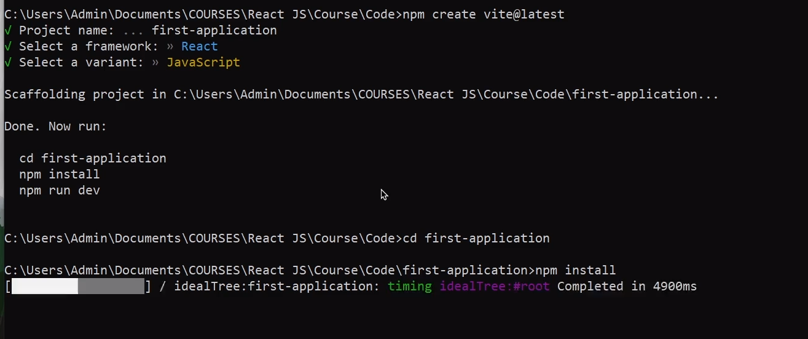
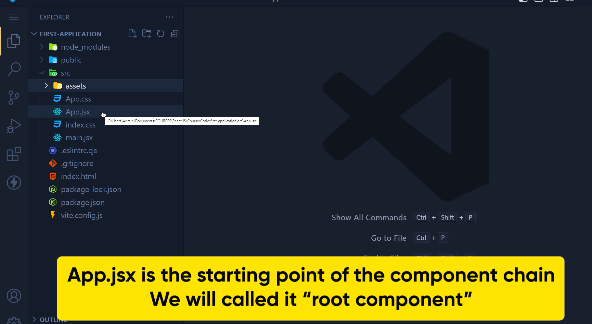
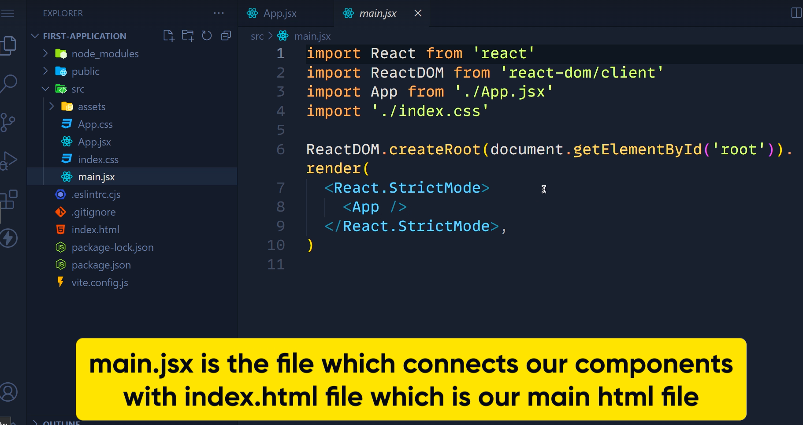

https://reactjs.org/
https://create-react-app.dev/

codepen.io/open

My codepen examples :  https://codepen.io/your-work/

Babel is transcoder which will convert into understandable js by browsers.  (transcoder example : bable /typescript/ livescript /coffie script)

ES (ecmascript ) -is latest javascript version.

https://babeljs.io/repl/#?browsers=defaults%2C%20not%20ie%2011%2C%20not%20ie_mob%2011&build=&builtIns=false&corejs=3.6&spec=false&loose=false&code_lz=Q&debug=false&forceAllTransforms=false&shippedProposals=false&circleciRepo=&evaluate=false&fileSize=false&timeTravel=false&sourceType=module&lineWrap=true&presets=env%2Creact%2Cstage-2&prettier=false&targets=&version=7.17.0&externalPlugins=&assumptions=%7B%7D

CDN - content delivery network where you can find different java script

codePan -- in js property file select react , and react-dom.  for any error you can on refer console in codepen.io
for react development you need react.min.js and react.dom.js

you need to have node.js  and npm for working in react.
**create react project**

//   create my-app react project by below command for node version above 5.02

**npx create-react-app**  my-app

**other way better than create react**

https://vitejs.dev/guide/
npm create vite@latest 
or npm create vite@latest tasktrek --- --template React
1. give project name
2. select 
3. 

JSX-- java script html

JSX comtains java + html
babel convert jsx-->javascript

1. Html -->

2.  ReactDOM.render(<h1> hello Mukesh</h1>,
    document.getElementById('root')
    );---> param1 = what to render and  param2= where to render.

-----------------------------------------------------

Local setup.

1. install Atom.io (editor)
2. install node.
3. run command node -v vand npm -v to check installed version.
4. instll brew (home brew) to run installation command.

Get started in seconds
Whether you’re using React or another library, Create React App lets you focus on code, not build tools.

To create a project called my-app, run this command:

npx create-react-app my-app  ==> will create new app named  "my-app"

cd my-app
start my-app ==> to run my-app

------------------------------------------------------

why react is fast because it work on virtual dom not on the real dom and one way data binding ( so if anything updated 
on virtual dom it will update that field only in real dom.

Chepter 2.

function App() {
return (

<Header></Header>  --> custom component
<h1>This is footer</h1>

);
}

this will always return a one enclosing component. like here only one div component which contain all things

- After declaring component there is two ways to export component

1 . export default Header; (at end of component file )
2.  using export default  just before component definition . Ex.

export default function Header(){

}

importing component :
---------------------

import Image from './Image';      this is import Image component from Image.js file

--------------------------

virtual dom --> only update changed part in dom so only that part got render not the complete dom.

---------------------

Props and  state (lifecycle)

by using Props you transfer data between two components so that they can 
communicate.

pure component
---------------

will render once anything is updated on it otherwise not. better performance than component.