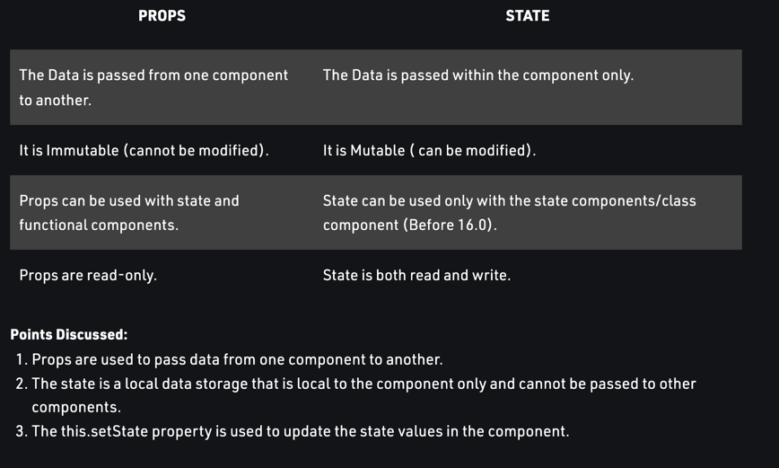

END UI :  

display all course and price and onclick of each row of course total course will be 
display on bottom

name : Hadoop price: 199
name : Java price: 150
name : React price: 100

Total price : 100

#Flow

1. App.js set courses like json object  and pass course to CourseSales
2. ### CourseSales passes properties / method (Imp) to Course
3. Course will call method (calculatePrice of Parent (courseSales)) and render Course 
  and call calculatePrice on click of course.

#in constructor
this.State = {
total : 0
}

# in method call

this.setState (
{total : 5}
)

# Difference between state and prop

props are used to pass properties from one component to other.
State is part of one component (like s)

